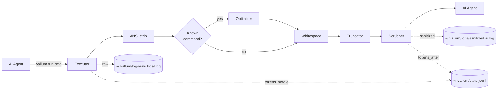

# Vallum

A Rust CLI proxy that sits between AI agents and your shell. It sanitizes secrets, flags prompt injections, strips ANSI noise, compresses long outputs, preserves child exit codes, audits every command, and tracks how many tokens you save — so what reaches the model is exactly what you intend it to see.

---

## Why

When an AI agent runs shell commands on your behalf, three problems compound:

- Output may contain **secrets** — API keys, tokens, credentials — that are forwarded straight to the model.
- Output may contain **adversarial text** — log lines, scraped pages, or error messages crafted to hijack the agent.
- Long outputs **burn tokens** and bury the relevant signal in noise.

Vallum is a single binary that handles all three.

## Pipeline



Each command flows through these stages:

1. **Execute** — `stdout` and `stderr` are captured into one buffer.
2. **ANSI strip** — color and cursor-control escapes are removed.
3. **Optimize** — if a registered `CommandOptimizer` matches (e.g. `git status`, `cargo test`, `pytest`, `npm test`), it produces a compressed view; otherwise the input passes through.
4. **Whitespace collapse** — runs of three or more blank lines collapse to one; trailing spaces are stripped.
5. **Truncate** — a head/tail window is preserved, error lines are pulled out of the middle, the rest is elided.
6. **Scrub** — common API tokens, bearer credentials, Slack tokens, and PEM private keys are redacted; known injection phrases are neutralized.
7. **Wrap** — output is enclosed in `[UNTRUSTED TERMINAL OUTPUT]` markers.
8. **Audit + Metrics** — raw output and sanitized output are written under `~/.vallum/logs/`, and a per-command stats record is appended to `~/.vallum/stats.jsonl`.

## Built-in Optimizers

- `git status`: summarizes large working-tree sections while keeping branch state and representative file entries
- `cargo build|test|check|clippy|run`: collapses compile/download noise and preserves summaries, failures, and diagnostics
- `pytest` and `python -m pytest`: hides progress-dot spam while keeping collection, failure, and summary sections
- `npm test|install|ci|run`: collapses repeated `PASS` and warning lines while preserving result summaries

## Configuration

Vallum looks for `~/.vallum/config.toml` by default. For testing or per-project overrides, point `VALLUM_CONFIG` at a different file.

```toml
[audit]
log_dir = "/tmp/vallum-logs"
raw_enabled = false
sanitized_enabled = true

[pipeline]
head_lines = 20
tail_lines = 20

[scrubber]
extra_secret_patterns = [
  { pattern = "token-[0-9]+", replacement = "token-***" }
]
```

Supported first-pass settings:

- `audit.log_dir`: audit log directory override
- `audit.raw_enabled`: enable or disable raw terminal logs
- `audit.sanitized_enabled`: enable or disable sanitized logs
- `pipeline.head_lines` / `pipeline.tail_lines`: truncation window
- `scrubber.extra_secret_patterns`: extra regex-based redaction rules

## Install

```bash
cargo build --release
```

The binary lands at `target/release/vallum`.

## Usage

```bash
vallum run <command> [args...]    # run a command through the proxy
vallum run --json <command> ...   # emit structured JSON for agent/automation use
vallum stats                      # show cumulative token savings
vallum stats --reset              # delete all collected stats (prompts)
```

Examples:

```bash
vallum run ls -la
vallum run cargo test
vallum run git status
vallum run pytest
vallum run npm test
vallum run sh -- -c 'exit 7'      # preserves the child exit code
vallum run --json printf "hello\n"
```

Example JSON output:

```json
{
  "command": "printf",
  "args": ["hello\\n"],
  "exit_code": 0,
  "optimizer": null,
  "tokens_before": 1,
  "tokens_after": 18,
  "sanitized_output": "[UNTRUSTED TERMINAL OUTPUT START]\nhello\n[UNTRUSTED TERMINAL OUTPUT END]\n"
}
```

## Measuring savings

Every `vallum run` appends one JSON record to `~/.vallum/stats.jsonl` with the raw and sanitized token estimates (chars / 4). `vallum stats` aggregates that file:

```
Vallum — Token savings report
─────────────────────────────────────────
Commands run:        142
Tokens (raw):        58,420
Tokens (sanitized):  11,205
Saved:               47,215  (80.8%)

Top savings by command
─────────────────────────────────────────
cargo build           18,940 saved   (94%)
git status            12,103 saved   (88%)
npm install            8,442 saved   (76%)
```

## Modules

| File                          | Responsibility                                       |
| ----------------------------- | ---------------------------------------------------- |
| `src/cli.rs`                  | Argument parsing (`run`, `stats`)                    |
| `src/config.rs`               | Config loading, defaults, and validation             |
| `src/executor.rs`             | Spawning commands and capturing output               |
| `src/ansi.rs`                 | Stripping ANSI escape sequences                      |
| `src/whitespace.rs`           | Collapsing blank-line runs, stripping trailing space |
| `src/optimizer/mod.rs`        | `CommandOptimizer` trait + dispatch registry         |
| `src/optimizer/cargo.rs`      | Summary optimizer for noisy `cargo` output           |
| `src/optimizer/git_status.rs` | Summary optimizer for `git status` output            |
| `src/optimizer/npm.rs`        | Summary optimizer for noisy `npm` output             |
| `src/optimizer/pytest.rs`     | Summary optimizer for noisy `pytest` output          |
| `src/truncator.rs`            | Head/tail window with error preservation             |
| `src/scrubber.rs`             | Secret redaction and injection neutralization        |
| `src/audit.rs`                | Append-only log writer                               |
| `src/metrics.rs`              | Token estimator + JSONL stats writer                 |
| `src/stats.rs`                | `vallum stats` aggregation and reporting             |
| `src/main.rs`                 | Pipeline wiring                                      |

## Roadmap

- [x] v0.1 — MVP: execute, truncate, scrub, audit
- [x] v0.2 — ANSI strip, whitespace collapse, token metrics, per-command optimizer framework, `vallum stats`
- [x] Post-v0.2 hardening — exit-code propagation, structured JSON output, configurable pipeline settings, cargo/pytest/npm optimizers
- [ ] Next — exact tiktoken counting, optimizer toggles, broader command coverage, streaming/PTY support

## Name

**Vallum** — Latin for the defensive embankment along Roman frontier fortifications. The thing that stands between what's inside and what's outside.

## License

Licensed under either of

- Apache License, Version 2.0, ([LICENSE-APACHE](LICENSE-APACHE) or <http://www.apache.org/licenses/LICENSE-2.0>)
- MIT license ([LICENSE-MIT](LICENSE-MIT) or <http://opensource.org/licenses/MIT>)

at your option.

### Contribution

Unless you explicitly state otherwise, any contribution intentionally submitted for inclusion in this work by you, as defined in the Apache-2.0 license, shall be dual licensed as above, without any additional terms or conditions.
