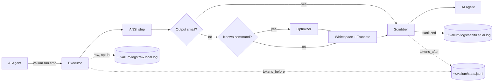

# Vallum

A Rust CLI proxy that sits between AI agents and your shell as a **security boundary**. When an agent runs a command, Vallum redacts secrets, neutralizes prompt-injection attempts, wraps the result as untrusted data, preserves the child exit code, and audits everything — so what reaches the model is exactly what you intend it to see. As a side benefit, it strips ANSI noise and compresses long output, which also saves tokens.

---

## Why

When an AI agent runs shell commands on your behalf, the command output flows straight into the model's context. That output is **untrusted input**, and it creates three problems:

- It may contain **secrets** — API keys, tokens, credentials — that get forwarded to the model (and possibly logged by it).
- It may contain **adversarial text** — log lines, scraped pages, or error messages crafted to hijack the agent ("ignore previous instructions…").
- It is **unstructured and noisy**, burying the relevant signal and inflating token usage.

Vallum is a single binary that puts a controlled boundary between that output and the model.

> **Scope of the guarantees.** Secret redaction and injection neutralization are **best-effort, pattern-based** defenses. They raise the cost of an attack and catch common cases; they are not a substitute for treating all terminal output as untrusted. The untrusted-output wrapper is the durable control — keep your agent prompted to respect it.

## Pipeline



Each command flows through these stages:

1. **Execute** — `stdout` and `stderr` are captured concurrently and merged in arrival order. Capture is bounded by a byte cap and a timeout (see Configuration). `stdin` is inherited so interactive commands work.
2. **ANSI strip** — color and cursor-control escapes are removed.
3. **Short-circuit** — if the output is below `min_optimize_tokens`, the optimize and truncate stages are skipped (no point summarizing a few lines). The security stages below always run.
4. **Optimize** — if a registered `CommandOptimizer` matches (e.g. `git status`, `cargo test`, `pytest`, `npm test`), it produces a compressed view; otherwise the input passes through.
5. **Whitespace collapse** — runs of three or more blank lines collapse to one; trailing spaces are stripped.
6. **Truncate** — head/tail windows are preserved; important lines (errors, panics, failures) are kept **in place with surrounding context**, and ordinary gaps are elided.
7. **Scrub** — API tokens, bearer credentials, Slack tokens, and PEM private keys are redacted; known injection phrases are neutralized.
8. **Wrap** — output is enclosed in `[UNTRUSTED TERMINAL OUTPUT]` markers; any forged markers inside the content are defanged so output can't break out of the wrapper.
9. **Audit + Metrics** — the sanitized output is written under `~/.vallum/logs/` (raw logging is opt-in), and a per-command stats record is appended to `~/.vallum/stats.jsonl`.

## Security model

- **Secret redaction** runs on every command's output before it is shown or logged (sanitized log). Patterns cover OpenAI-style `sk-` keys, GitHub `ghp_`/`github_pat_` tokens, Slack `xox*` tokens, JWT bearer headers, and PEM private keys. Extend with your own regex rules via config.
- **Injection neutralization** is pattern-based and best-effort: it flags common families ("ignore/disregard/forget previous instructions", "you are now…", "reveal your system prompt", injected `Assistant:`/`System:` turns) and replaces them with `[POTENTIAL INJECTION NEUTRALIZED]`.
- **Untrusted-output wrapper** brackets every result and defangs any embedded marker strings, so a command cannot forge an early close and smuggle "trusted" text past the boundary. This adds a small fixed token overhead on tiny outputs — accepted by design, because the boundary is size-independent.
- **Logs are private.** Raw (unredacted) logging is **off by default**; the sanitized log and stats file are created with `0600` permissions on unix.

## Built-in Optimizers

- `git status`: summarizes large working-tree sections while keeping branch state and representative file entries
- `cargo build|test|check|clippy|run`: collapses compile/download noise and preserves summaries, failures, and diagnostics
- `pytest` and `python -m pytest`: hides progress-dot spam while keeping collection, failure, and summary sections
- `npm test|install|ci|run`: collapses repeated `PASS` and warning lines while preserving result summaries

## Configuration

Vallum looks for `~/.vallum/config.toml` by default. For testing or per-project overrides, point `VALLUM_CONFIG` at a different file.

```toml
[audit]
log_dir = "/tmp/vallum-logs"
raw_enabled = false          # raw, unredacted logging is opt-in
sanitized_enabled = true

[pipeline]
head_lines = 20
tail_lines = 20
min_optimize_tokens = 50     # skip optimize/truncate below this token estimate
max_output_bytes = 10485760  # 10 MiB capture cap; excess is dropped with a marker
timeout_secs = 300           # kill the child after N seconds (0 = disabled)

[scrubber]
extra_secret_patterns = [
  { pattern = "token-[0-9]+", replacement = "token-***" }
]
```

Supported settings:

- `audit.log_dir`: audit log directory override
- `audit.raw_enabled`: enable raw (unredacted) terminal logs — **default `false`**
- `audit.sanitized_enabled`: enable or disable sanitized logs
- `pipeline.head_lines` / `pipeline.tail_lines`: truncation window
- `pipeline.min_optimize_tokens`: outputs below this estimate skip optimize/truncate
- `pipeline.max_output_bytes`: maximum bytes captured from a command (default 10 MiB)
- `pipeline.timeout_secs`: command timeout in seconds; `0` disables it (default 300)
- `scrubber.extra_secret_patterns`: extra regex-based redaction rules

## Install

```bash
cargo build --release
```

The binary lands at `target/release/vallum`.

## Usage

```bash
vallum run <command> [args...]    # run a command through the proxy
vallum run --json <command> ...   # emit structured JSON for agent/automation use
vallum stats                      # show cumulative token savings
vallum stats --reset              # delete all collected stats (prompts)
```

Examples:

```bash
vallum run ls -la
vallum run cargo test
vallum run git status
vallum run pytest
vallum run npm test
vallum run sh -- -c 'exit 7'      # preserves the child exit code
vallum run --json printf "hello\n"
```

Example JSON output:

```json
{
  "command": "printf",
  "args": ["hello\\n"],
  "exit_code": 0,
  "optimizer": null,
  "tokens_before": 1,
  "tokens_after": 18,
  "sanitized_output": "[UNTRUSTED TERMINAL OUTPUT START]\nhello\n[UNTRUSTED TERMINAL OUTPUT END]\n"
}
```

Note how a tiny output ends up *larger* after wrapping: the security wrapper has a fixed cost, and on short commands that cost dominates. Token savings show up on the large, noisy outputs (builds, test runs, big diffs) — see below.

## Measuring savings

Every `vallum run` appends one JSON record to `~/.vallum/stats.jsonl` with raw and sanitized token estimates. Counting goes through a pluggable `TokenEstimator`; the default is a dependency-free heuristic (word runs + symbols) that tracks BPE better than a flat chars/4 ratio. `vallum stats` aggregates the file:

```
Vallum — Token savings report
─────────────────────────────────────────
Commands run:        142
Tokens (raw):        58,420
Tokens (sanitized):  11,205
Saved:               47,215  (80.8%)

Top savings by command
─────────────────────────────────────────
cargo build           18,940 saved   (94%)
git status            12,103 saved   (88%)
npm install            8,442 saved   (76%)
```

## Modules

| File                          | Responsibility                                       |
| ----------------------------- | ---------------------------------------------------- |
| `src/cli.rs`                  | Argument parsing (`run`, `stats`)                    |
| `src/config.rs`               | Config loading, defaults, and validation             |
| `src/executor.rs`             | Concurrent capture with byte cap, timeout, stdin     |
| `src/ansi.rs`                 | Stripping ANSI escape sequences                      |
| `src/whitespace.rs`           | Collapsing blank-line runs, stripping trailing space |
| `src/optimizer/mod.rs`        | `CommandOptimizer` trait + dispatch registry         |
| `src/optimizer/cargo.rs`      | Summary optimizer for noisy `cargo` output           |
| `src/optimizer/git_status.rs` | Summary optimizer for `git status` output            |
| `src/optimizer/npm.rs`        | Summary optimizer for noisy `npm` output             |
| `src/optimizer/pytest.rs`     | Summary optimizer for noisy `pytest` output          |
| `src/truncator.rs`            | Context-preserving head/tail truncation              |
| `src/scrubber.rs`             | Secret redaction, injection neutralization, wrapping |
| `src/tokenizer.rs`            | Pluggable `TokenEstimator` + heuristic default       |
| `src/fsutil.rs`               | Private (0600) append-file helper                    |
| `src/audit.rs`                | Append-only log writer                               |
| `src/metrics.rs`              | Token estimation + JSONL stats writer                |
| `src/stats.rs`                | `vallum stats` aggregation and reporting             |
| `src/main.rs`                 | Pipeline wiring                                      |

## Roadmap

- [x] v0.1 — MVP: execute, truncate, scrub, audit
- [x] v0.2 — ANSI strip, whitespace collapse, token metrics, per-command optimizer framework, `vallum stats`
- [x] Post-v0.2 hardening — exit-code propagation, structured JSON output, configurable pipeline, cargo/pytest/npm optimizers
- [x] Security sweep — concurrent bounded capture (cap + timeout + stdin), context-preserving truncation, broadened injection neutralization, marker anti-spoofing, raw-logs-off-by-default with `0600` perms, small-output short-circuit, pluggable token estimator
- [ ] Next — exact BPE token counting (swappable behind `TokenEstimator`), optimizer toggles, broader command coverage, streaming/PTY support

## Name

**Vallum** — Latin for the defensive embankment along Roman frontier fortifications. The thing that stands between what's inside and what's outside.

## License

Licensed under either of

- Apache License, Version 2.0, ([LICENSE-APACHE](LICENSE-APACHE) or <http://www.apache.org/licenses/LICENSE-2.0>)
- MIT license ([LICENSE-MIT](LICENSE-MIT) or <http://opensource.org/licenses/MIT>)

at your option.

### Contribution

Unless you explicitly state otherwise, any contribution intentionally submitted for inclusion in this work by you, as defined in the Apache-2.0 license, shall be dual licensed as above, without any additional terms or conditions.
