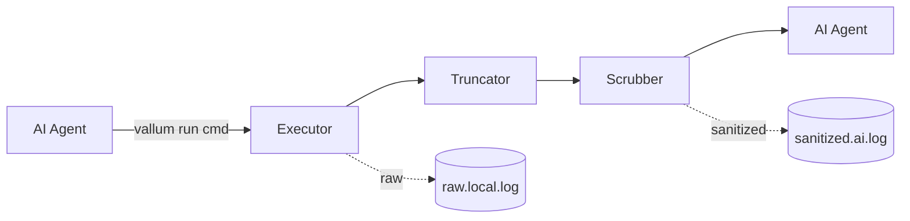

# Vallum

A Rust CLI proxy that sits between AI agents and your shell. It sanitizes secrets, flags prompt injections, truncates noisy output, and audits every command — so what reaches the model is exactly what you intend it to see.

---

## Why

When an AI agent runs shell commands on your behalf, three problems compound:

- Output may contain **secrets** — API keys, tokens, credentials — that are forwarded straight to the model.
- Output may contain **adversarial text** — log lines, scraped pages, or error messages crafted to hijack the agent.
- Long outputs **burn tokens** and bury the relevant signal in noise.

Vallum is a single binary that handles all three.

## Pipeline



Each command flows through five stages:

1. **Execute** — `stdout` and `stderr` are captured into one buffer.
2. **Truncate** — a head/tail window is preserved, error lines are pulled out of the middle, the rest is elided.
3. **Scrub** — `sk-*` and `ghp_*` tokens are redacted; known injection phrases are neutralized.
4. **Wrap** — output is enclosed in `[UNTRUSTED TERMINAL OUTPUT]` markers.
5. **Audit** — the raw output and the sanitized output are appended to separate log files.

## Install

```bash
cargo build --release
```

The binary lands at `target/release/vallum`.

## Usage

```bash
vallum run <command> [args...]
```

Examples:

```bash
vallum run ls -la
vallum run cargo test
vallum run git status
```

## Modules

| File              | Responsibility                                |
| ----------------- | --------------------------------------------- |
| `src/cli.rs`      | Argument parsing                              |
| `src/executor.rs` | Spawning commands and capturing output        |
| `src/truncator.rs`| Head/tail window with error preservation      |
| `src/scrubber.rs` | Secret redaction and injection neutralization |
| `src/audit.rs`    | Append-only log writer                        |
| `src/main.rs`     | Pipeline wiring                               |

## Roadmap

- [x] v0.1 — MVP: execute, truncate, scrub, audit
- [x] v0.2 — ANSI strip, whitespace collapse, token metrics, per-command optimizer framework, `vallum stats`
- [ ] v0.3 — exact tiktoken counting, more optimizers (cargo, npm), config file

## Name

**Vallum** — Latin for the defensive embankment along Roman frontier fortifications. The thing that stands between what's inside and what's outside.
