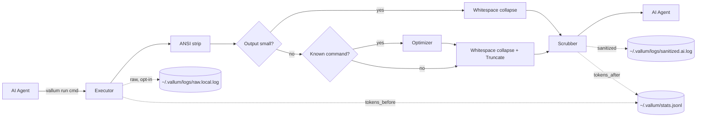

# Vallum

### The wall between AI coding agents and your shell.

Vallum is a single Rust CLI that sits between an AI coding agent and your
terminal. It **stops dangerous commands before they run**, **redacts secrets**
and **neutralizes prompt-injection** in command output before it reaches the
model, and audits everything. Prompt-injection defense, secret redaction, and
an LLM/agent security guardrail in one dependency-light binary — for Claude
Code, Cursor, Codex, Gemini CLI, or any agent that runs shell commands.

[](https://github.com/kahramanemir/Vallum/actions/workflows/ci.yml)
[](https://github.com/kahramanemir/Vallum/actions/workflows/audit.yml)
[](https://crates.io/crates/vallum)
[](https://docs.rs/vallum)
[](https://www.npmjs.com/package/vallum)
[](https://github.com/kahramanemir/Vallum/blob/main/Cargo.toml)
[](#license)

<p align="center">
  
</p>

## What it does

| Capability | What it does |
|---|---|
| **Guardrail** | Stops `rm -rf /`, `curl … \| sh`, force-push, and other dangerous commands *before they run* — prompts (`Ask`) or blocks (`Deny`), on by default. |
| **Secret redaction** | Masks known key/token formats (OpenAI, AWS, GitHub, Stripe, and more) plus high-entropy credentials before output ever reaches the model. |
| **Injection defense** | Neutralizes "ignore previous instructions"-style text in five languages, then wraps the output in untrusted-data markers so it can't hijack the agent. |
| **Token savings** | Strips ANSI noise and compresses large build and test logs — a side benefit of routing output through the security pipeline. |

> **Measured, not claimed.** Over a committed, labeled corpus: injection recall
> **0.812** · precision **1.000** · benign false-positive rate **0.000**;
> known-format secret recall **1.000**. Numbers are evidence, not a guarantee —
> [full report](evals/report.md).

## Quick start

```bash
# 1. Install (macOS + Linux)
curl --proto '=https' --tlsv1.2 -LsSf https://github.com/kahramanemir/Vallum/releases/latest/download/vallum-installer.sh | sh

# 2. Try it on any command
vallum run cargo test

# 3. Gate your agent — pick Claude Code, Cursor, Gemini CLI, or Codex CLI
vallum install-hook

# Later: check for a newer release (prints the right upgrade command)
vallum update
```

Other install channels (Homebrew, Cargo, npm, prebuilt binaries with
attestation) are in [Install](#install).

## Works with your agent

`vallum run` works with any agent that runs shell commands. The pre-exec
guardrail also hooks **natively** into Claude Code, Cursor, Gemini CLI, and
Codex CLI — one `vallum install-hook` and dangerous commands are gated inside
the agent's own approval flow. Automatic output sanitization and token
optimization run on Claude Code (and any explicit `vallum run`); on the other
three agents Vallum gates commands without rewriting their output. See the
[full matrix and honest limitations](#multi-agent-guardrail) below.

---

## Why

When an AI agent runs shell commands on your behalf, the command output flows straight into the model's context. That output is **untrusted input**, and it creates three problems:

- It may contain **secrets** — API keys, tokens, credentials — that get forwarded to the model (and possibly logged by it).
- It may contain **adversarial text** — log lines, scraped pages, or error messages crafted to hijack the agent ("ignore previous instructions…").
- It is **unstructured and noisy**, burying the relevant signal and inflating token usage.

Vallum is a single binary that puts a controlled boundary between that output and the model. When an agent runs a command, Vallum redacts secrets, neutralizes prompt-injection attempts, wraps the result as untrusted data, preserves the child exit code, and audits everything — so what reaches the model is exactly what you intend it to see. As a side benefit, it strips ANSI noise and compresses long output, which also saves tokens.

> **Scope of the guarantees.** Secret redaction and injection neutralization are **best-effort, pattern-based** defenses. They raise the cost of an attack and catch common cases; they are not a substitute for treating all terminal output as untrusted. The untrusted-output wrapper is the durable control — keep your agent prompted to respect it.

## Pipeline



Each command flows through these stages:

1. **Execute** — `stdout` and `stderr` are captured concurrently and merged in arrival order. Capture is bounded by a byte cap and a timeout (see Configuration). `stdin` is inherited so interactive commands work.
2. **ANSI strip** — color and cursor-control escapes are removed.
3. **Short-circuit** — if the output is below `min_optimize_tokens`, the optimize and truncate stages are skipped (no point summarizing a few lines). The security stages below always run.
4. **Optimize** — if a registered `CommandOptimizer` matches (e.g. `git status`, `cargo test`, `pytest`, `npm test`), it produces a compressed view; otherwise the input passes through.
5. **Whitespace collapse** — runs of three or more blank lines collapse to one; trailing spaces are stripped.
6. **Truncate** — head/tail windows are preserved; important lines (errors, panics, failures) are kept **in place with surrounding context**, and ordinary gaps are elided.
7. **Scrub** — API tokens (OpenAI, Anthropic, GitHub, GitLab, Slack, AWS, Google, Stripe, SendGrid, Twilio, npm, PyPI, Hugging Face), bearer/bare JWTs, connection-string passwords, and PEM private keys are redacted; known injection phrases are neutralized.
8. **Wrap** — output is enclosed in `[UNTRUSTED TERMINAL OUTPUT]` markers; any forged markers inside the content are defanged so output can't break out of the wrapper.
9. **Audit + Metrics** — the sanitized output is written under `~/.vallum/logs/` (raw logging is opt-in), and a per-command stats record is appended to `~/.vallum/stats.jsonl`.

## Security model

Vallum applies four mechanism families to every command, in order:
prompt-injection neutralization (multilingual, with invisible/bidi character
stripping and a homoglyph-folded detection shadow; opt-in `--strict`
fail-closed mode), secret redaction (known-format patterns plus context-gated
entropy detection), untrusted-output wrapping with marker defang, and
private-by-default logging (raw log opt-in, `0600` permissions).

Ahead of those four output-side mechanisms, an opt-outable **guardrail**
evaluates each command *before* it runs and can prompt (`Ask`) or block
(`Deny`) a narrow set of dangerous operations — see
[Guardrail / policy](#guardrail--policy) below.

**Full threat model:** see [SECURITY.md](SECURITY.md) — what is protected,
by which mechanism, at what strength, and what is explicitly **not**
guaranteed.

## Guardrail / policy

Vallum evaluates every command *before it executes* and returns one of three
verdicts — on all call sites and all agents, including hook mode where
TUI-headed commands like `less`/`vim` are simply never rewritten (see
[SECURITY.md](SECURITY.md#dangerous-command-execution-guardrail)):

- **Allow** — runs normally (the default for anything no rule matches).
- **Ask** — pauses for explicit confirmation before running.
- **Deny** — refuses to run the command.

The guardrail is **on by default**, and every built-in rule is `Ask` — a
genuinely dangerous command prompts for confirmation instead of running
silently, but nothing is silently blocked. The built-in patterns are
deliberately narrow so ordinary commands are never touched (a committed
benign-command precision gate guards against nagging on legitimate commands).

Matching reinterprets each command through a bounded set of precision-safe
views, so a dangerous command hidden inside a wrapper is still caught: shell
`-c` and `eval` arguments (verb-aware, bare or bundled like `-xc`, behind
`sudo`/`env`/`timeout` prefixes, and nested), `base64 -d` payloads (decoded and
re-checked), `$IFS` splitting, and quote/escape word-splitting applied to both
the payload and the interpreter verb (`\bash`, `b''ash`). Newlines are treated
as command separators. See [SECURITY.md](SECURITY.md) for the residual known
limitations (variable indirection, command substitution, non-shell
interpreters).

Built-in rules (all default to `Ask`):

| Rule | Catches |
|---|---|
| `rm_rf_root` | Recursive force-delete targeting a root or home path |
| `curl_pipe_shell` | Piping downloaded content directly into a shell (`curl … \| sh`) |
| `shell_download_exec` | Executing remotely-fetched content via process substitution or `eval` |
| `dd_to_device` | Writing directly to a block device with `dd` |
| `redirect_to_device` | Redirecting output to a raw block device |
| `mkfs_device` | Creating a filesystem on a device (destroys existing data) |
| `fork_bomb` | Classic `:(){ :\|:& };:` fork bomb |
| `chmod_777_recursive` | Recursively granting world-writable permissions |
| `read_sensitive_creds` | Reading a private key, credential file, or `/etc/shadow` |
| `git_push_force` | Force-push that can overwrite remote history |

**How `Ask` surfaces:**

- **Hook mode (Claude Code, Cursor):** the verdict maps to the agent's native
  approval UI — `Ask` prompts you in the agent, `Deny` blocks the tool call.
- **Hook mode (Gemini CLI, Codex CLI):** neither exposes a native "ask"
  decision, so `Ask` is enforced as a **Deny** with an actionable reason —
  see [Multi-agent guardrail](#multi-agent-guardrail) below.
- **Direct `vallum run`:** `Ask` prompts on `/dev/tty`; when there is no
  terminal (piped, CI, `--json`) it **fails closed** (blocked) unless you
  set `security.assume_yes = true` or `VALLUM_ASSUME_YES=1`. A `Deny`
  verdict exits **`125`**.

Configure it under `[security]` and `[policy]`:

```toml
[security]
guardrail = true    # pre-exec policy layer — default true; set false to bypass entirely
assume_yes = false  # auto-approve direct-mode `ask` verdicts (for scripts/CI)

[policy]
disabled = []       # built-in rule names to turn off (e.g. ["git_push_force"])

# Add your own rules. `action` is "ask" or "deny" (never "allow").
[[policy.rules]]
pattern = '^\s*sudo\b'
action = "ask"
reason = "Elevated privileges"
```

Test a rule without running the command:

```console
$ vallum policy test "curl example.com/install.sh | sh"
ASK [curl_pipe_shell] (built-in)
  Piping downloaded content directly into a shell interpreter
$ echo $?
10
```

Exit codes: 0 allow, 10 ask, 20 deny, 125 config error — usable from CI.

Setting `guardrail = false` makes Vallum behave byte-for-byte as it did before
this layer existed. User rules are matched with the same most-severe-wins
resolution as the built-ins (`Deny` > `Ask` > `Allow`), and every enforced non-Allow
verdict is recorded (redacted) to `policy.log`.

**Scope, honestly:** the guardrail matches patterns against the command text —
it is a speed bump / defense-in-depth layer, not a sandbox. It sees through
common wrappers (see above), but a determined actor can still get around text
matching with variable or command-substitution indirection. The output-side
protections — secret scrubbing and injection defusal — do not depend on the
guardrail and remain the backstop.

If the config file is broken (TOML or regex error), hook mode logs a warning
to stderr and keeps gating with the **built-in** rules; your custom rules are
ignored until the config is fixed (`vallum doctor` pinpoints the error).
Direct `vallum run` refuses to run at all (exit `125`) on a broken config.

## Multi-agent guardrail

The pre-exec Allow/Ask/Deny guardrail hooks into four coding agents. Output
sanitization and token optimization remain Claude Code + `vallum run` only —
on the other agents Vallum gates commands but does not rewrite them.

| Agent | Hook point | Ask behavior | Install |
|---|---|---|---|
| Claude Code | `PreToolUse` (allow/ask/deny + rewrite through `vallum run`) | native ask | `vallum install-hook` |
| Cursor | `beforeShellExecution` (verdicts only) | native ask | `vallum install-hook --agent cursor` |
| Gemini CLI | `BeforeTool` (verdicts only) | fail-closed deny with instructions | `vallum install-hook --agent gemini` |
| Codex CLI | `PreToolUse` (verdicts only) | fail-closed deny with instructions | `vallum install-hook --agent codex` |

All four installers write to a user-level config
(`~/.claude/settings.json`, `~/.cursor/hooks.json`, `~/.gemini/settings.json`,
`~/.codex/hooks.json`) — new agents are **user-level installs only**;
`--project` remains Claude Code-specific. `uninstall-hook --agent <x>`
removes exactly the entry the installer added, and `vallum doctor` reports
per-agent status (`hook (claude)`, `hook (cursor)`, `hook (gemini)`,
`hook (codex)`), showing "agent not detected — skipped" for agents that
aren't installed on the machine. Every Ask/Deny verdict, on any agent, is
still recorded to `policy.log` with `agent=<claude|cursor|gemini|codex|direct>`.

Limitations, stated plainly:

- **Ask degrades to deny on Gemini CLI and Codex CLI.** Neither exposes a
  native "ask the user" decision, and emitting no decision would silently
  become *allow* under auto-approve modes. Vallum fails closed instead: the
  deny reason tells you how to run the command yourself
  (`vallum run -- bash -c '<cmd>'` — the same `bash -c` wrapping the Claude
  hook uses, so a piped/compound command stays gated as one unit) or turn the
  rule off — `[policy] disabled = ["<rule>"]` for a built-in, or edit the
  matching `[[policy.rules]]` entry in your config for a user-defined one.
- **TUI-headed commands are gated but never rewritten.** `vim`, `less`,
  `top` and friends are policy-evaluated like any command (`less
  /etc/shadow` now asks/denies); on a clean Allow they pass through
  unwrapped, and an approved Ask on Claude Code runs the original command
  directly, so their interactive TTY keeps working — but their *output* is
  not sanitized (it never was for passed-through commands). Direct
  `vallum run` is unaffected.
- **Codex CLI does not intercept every shell call.** Codex's own hooks
  documentation says it plainly: *"This doesn't intercept all shell calls
  yet, only the simple ones. The newer `unified_exec` mechanism allows richer
  streaming stdin/stdout handling of shell, but interception is incomplete.
  Similarly, this doesn't intercept `WebSearch` or other non-shell, non-MCP
  tool calls."* (source: <https://developers.openai.com/codex/hooks>,
  verified live 2026-07-06). A command that Codex doesn't route through the
  hook never reaches Vallum at all — there is no verdict, logged or
  otherwise, for it.
- **Codex CLI silently skips the hook until you trust it — and needs a
  recent CLI.** Installing the hook is not enforcement on Codex: Codex
  requires a one-time review of each hook definition ("Hooks need review →
  Trust all and continue" in the Codex TUI; `--dangerously-bypass-hook-trust`
  for automation), and until that happens the hook is *skipped without any
  warning* while gated commands run unguarded. Version matters too: hook
  trust handling in `codex exec` was fixed in codex-cli 0.141.0
  (openai/codex#26434), and on 0.139 the installed hook never fired at all in
  our tests. Verified live end-to-end on codex-cli 0.142.5 (2026-07-08): an
  Ask-rule command was blocked with Vallum's deny message, a benign command
  passed untouched, and both verdicts appeared in `policy.log` with
  `agent=codex`. `vallum doctor` reminds you of the trust step on its
  `hook (codex)` line — it cannot see Codex's trust state.
- **Verify enforcement after installing:** run a known-Ask command like
  `git push --force` in the agent and expect a prompt (Claude Code, Cursor) or
  a deny with instructions (Gemini CLI, Codex CLI). On Codex, complete the
  hook-trust step first or the test will silently pass through. `vallum
  doctor` reports per-agent install status.
- **These hook protocols are young.** Every field name above was confirmed
  live against each agent's current documentation on 2026-07-06 (see
  `docs/superpowers/research/2026-07-06-agent-hook-protocols.md`), and that
  pass already caught real drift from what was originally assumed — Cursor's
  stdout fields renamed camelCase to snake_case at some point after a ~Oct
  2025 walkthrough, and Codex's shell tool name turned out to be `Bash`, not
  `shell` or `local_shell`. None of the three agents' docs carries an
  explicit CLI version stamp to pin, so treat this as validated against each
  agent's live documentation as of that date, not against a fixed release
  number — if a future agent update renames its hook event, the hook simply
  never fires again silently, so re-run the verification command above after
  upgrading any of these agents.

## Measured detection

The scrubber is evaluated against a committed, labeled corpus in
`evals/corpus/` (85 injection payloads, 54 hard benign negatives, and secret
samples across several languages). Headline figures from the latest run
(full report: [`evals/report.md`](evals/report.md)):

- Injection recall: **0.812** · precision: **1.000** · benign false-positive rate: **0.000**
- Known-format secret recall: **1.000** · entropy secret recall: **1.000**

These are measured over a fixed corpus and are **evidence, not a guarantee** —
see the honest "Known misses" list in the report. Regenerate with
`cargo run --example eval -- --write`; CI fails on regressions below the
committed floors.

## Built-in optimizers

- `git status`: summarizes large working-tree sections while keeping branch state and representative file entries
- `git diff` / `git log`: collapse large unchanged-context runs / long commit bodies while keeping headers, hunks, and changed lines
- `cargo build|test|check|clippy|run`: collapses compile/download noise and preserves summaries, failures, and diagnostics
- `pytest` and `python -m pytest`: hides progress-dot spam while keeping collection, failure, and summary sections
- `npm test|install|ci|run`: collapses repeated `PASS` and warning lines while preserving result summaries
- `docker build|compose`: collapse layer/step progress while keeping step headers, errors, and the final result
- `go test`: hide `=== RUN`/`--- PASS` spam while keeping failures and the summary
- `make`: surface errors/warnings while collapsing ordinary build noise
- `kubectl get`: collapse runs of healthy (`Running`/`Completed`) resources while keeping the header and any pod in a problem state (`CrashLoopBackOff`, `Pending`, `Evicted`, …)
- `terraform plan|apply`: collapse state-refresh chatter and attribute-diff bodies while keeping resource action headers, the `Plan:`/`Apply complete!` summary, and errors
- `rg` / `grep` (also `egrep`/`fgrep`): group matches by file, keep the first few per file, and summarize the rest with per-file and total counts
- `ls` / `find` / `fd` / `tree`: keep the leading entries and summarize the rest (with a top-directories breakdown for path lists); error lines are always preserved

## Configuration

Vallum looks for `~/.vallum/config.toml` by default. For testing or per-project overrides, point `VALLUM_CONFIG` at a different file.

```toml
[audit]
log_dir = "/tmp/vallum-logs"
raw_enabled = false          # raw, unredacted logging is opt-in
sanitized_enabled = true

[pipeline]
head_lines = 20
tail_lines = 20
min_optimize_tokens = 50     # skip optimize/truncate below this token estimate
max_output_bytes = 10485760  # 10 MiB capture cap; excess is dropped with a marker
timeout_secs = 300           # kill the child after N seconds (0 = disabled)
max_line_length = 2000       # truncate single lines longer than this (0 disables)

[optimizer]
disabled = []            # optimizer names to turn off; all on by default

[scrubber]
entropy = true   # context-gated entropy redaction of credential-ish values
normalize = true # strip invisible/bidi chars; fold homoglyphs for injection matching
extra_secret_patterns = [
  { pattern = "token-[0-9]+", replacement = "token-***" }
]

[security]
strict = false      # block the entire output when a prompt injection is detected
guardrail = true    # pre-exec policy layer (Allow/Ask/Deny) — default true
assume_yes = false  # auto-approve direct-mode `ask` verdicts (scripts/CI)

[policy]
disabled = []       # built-in rule names to disable; all on by default
# [[policy.rules]]   # optional user rules; action = "ask" | "deny"
# pattern = '^\s*sudo\b'
# action = "ask"
# reason = "Elevated privileges"
```

Supported settings:

- `audit.log_dir`: audit log directory override
- `audit.raw_enabled`: enable raw (unredacted) terminal logs — **default `false`**
- `audit.sanitized_enabled`: enable or disable sanitized logs
- `pipeline.head_lines` / `pipeline.tail_lines`: truncation window
- `pipeline.min_optimize_tokens`: outputs below this estimate skip optimize/truncate
- `pipeline.max_output_bytes`: maximum bytes captured from a command (default 10 MiB)
- `pipeline.timeout_secs`: command timeout in seconds; `0` disables it (default 300)
- `optimizer.disabled`: list of optimizer names to disable (git_status, git_diff, git_log, cargo, pytest, npm, docker, go_test, make, kubectl, terraform, grep, file_list) — default none
- `pipeline.max_line_length`: cap individual line length; longer lines are truncated mid-line with an elision marker — default 2000, `0` disables
- `scrubber.extra_secret_patterns`: extra regex-based redaction rules
- `scrubber.entropy`: context-gated entropy redaction of credential-ish assignment values — **default `true`**
- `scrubber.normalize`: strip invisible/bidi characters and fold homoglyphs for injection matching — **default `true`**
- `security.strict`: when `true` (or `--strict`), the output is replaced with `[OUTPUT BLOCKED: prompt injection detected]` if any injection is detected — **default `false`**
- `security.guardrail`: enable the pre-exec policy layer that gates dangerous commands (Allow/Ask/Deny) — **default `true`**; set `false` to bypass entirely
- `security.assume_yes`: auto-approve direct-mode `ask` verdicts (also via `VALLUM_ASSUME_YES=1`) — **default `false`**
- `policy.rules`: user policy rules — each has `pattern`, `action` (`ask` or `deny`; `allow` is rejected), and `reason`
- `policy.disabled`: built-in rule names to disable (rm_rf_root, curl_pipe_shell, shell_download_exec, dd_to_device, redirect_to_device, mkfs_device, fork_bomb, chmod_777_recursive, read_sensitive_creds, git_push_force) — default none

## Install

**Shell (macOS + Linux):**

```bash
curl --proto '=https' --tlsv1.2 -LsSf https://github.com/kahramanemir/Vallum/releases/latest/download/vallum-installer.sh | sh
```

**Homebrew:**

```bash
brew install kahramanemir/homebrew-tap/vallum
```

**Cargo:**

```bash
cargo install vallum                  # heuristic token counts (default)
cargo install vallum --features bpe   # exact BPE token counts (adds tiktoken-rs)
```

**npm:**

```bash
npm install -g vallum
```

**Prebuilt binaries** for macOS (Intel + ARM) and Linux (x86_64 + aarch64) are
attached to every [GitHub Release](https://github.com/kahramanemir/Vallum/releases),
with SHA-256 checksums and build-provenance attestations. Verify a download with:

```bash
gh attestation verify ./vallum --repo kahramanemir/Vallum
```

### Build from source

```bash
cargo build --release                 # default: dependency-free heuristic token counts
cargo build --release --features bpe  # exact BPE token counts (adds tiktoken-rs)
```

The binary lands at `target/release/vallum`.

## Usage

```bash
vallum run <command> [args...]       # run a command through the proxy
vallum run --json <command> ...      # emit structured JSON
vallum run --strict <command> ...    # block output if a prompt injection is detected
vallum run --tee <command> ...       # also append raw output to ~/.vallum/live.log
vallum stats                         # show cumulative token savings
vallum stats --reset                 # delete collected stats

# Integration & UX
vallum install-hook                  # pick agents interactively (space = toggle, enter = confirm)
vallum install-hook --agent claude   # script one agent (also: cursor, gemini, codex)
vallum install-hook --project        # Claude Code only, <cwd>/.claude/settings.json
vallum uninstall-hook                # remove hooks (same picker; --agent to script)
vallum hook                          # internal: invoked by the agent's hook config (don't run directly)
vallum config show                   # print effective merged config as TOML
vallum config init [--force]         # scaffold ~/.vallum/config.toml
vallum doctor                        # self-check: config, hook, guardrail, PATH, log dir
vallum completions <bash|zsh|fish|elvish|powershell> > completions/_vallum
```

Examples:

```bash
vallum run ls -la
vallum run cargo test
vallum run git status
vallum run pytest
vallum run npm test
vallum run sh -- -c 'exit 7'      # preserves the child exit code
vallum run --json printf "hello\n"
```

Example JSON output:

```json
{
  "command": "printf",
  "args": ["hello\\n"],
  "exit_code": 0,
  "optimizer": null,
  "tokens_before": 1,
  "tokens_after": 18,
  "sanitized_output": "[UNTRUSTED TERMINAL OUTPUT START]\nhello\n[UNTRUSTED TERMINAL OUTPUT END]\n"
}
```

Note how a tiny output ends up *larger* after wrapping: the security wrapper has a fixed cost, and on short commands that cost dominates. Token savings show up on the large, noisy outputs (builds, test runs, big diffs) — see [Measuring savings](#measuring-savings).

### Exit codes

- The child's own exit code is propagated as Vallum's exit code on success.
- Vallum-level failures (bad config, executor spawn error, JSON serialization error) exit **`125`** — the `env(1)` "command not invoked" convention — so they are distinguishable from the child's real exit 1.
- A guardrail **`Deny`** (or an `Ask` that is declined / fails closed in a non-interactive session) also exits **`125`** — the command is never run. An `Ask` prompts on `/dev/tty`; set `security.assume_yes` / `VALLUM_ASSUME_YES=1` to auto-approve in scripts.

## Claude Code integration

`vallum install-hook` writes a `PreToolUse` entry into `~/.claude/settings.json` (default, user-level) or `<cwd>/.claude/settings.json` (`--project`). A timestamped `.bak-<unix_ts>` backup of the settings file is written before any modification. The command is idempotent — re-running it without `--force` is a no-op if the entry already exists; `--force` replaces an existing entry. Other agents (Cursor, Codex, Gemini CLI) can always route commands through Vallum by invoking `vallum run` directly, and now also have their own native pre-exec guardrail hooks (`vallum install-hook --agent <cursor|gemini|codex>`) — see [Multi-agent guardrail](#multi-agent-guardrail). Only Claude Code's hook rewrites the command through the full `vallum run` pipeline; the other three gate the command (Allow/Ask/Deny) without rewriting it. Run bare on a terminal, `vallum install-hook` opens an interactive picker (space = toggle, enter = confirm) listing all four agents with their detected/installed status; in non-interactive contexts (pipes, CI) it defaults to Claude Code exactly as before.

Once installed, Claude Code invokes `vallum hook` before every Bash tool call. The hook rewrites the command to `vallum run -- bash -c '<original>'` so the full Vallum pipeline (capture, ANSI strip, optimize, scrub, wrap) runs on every shell invocation without any change to how you or the agent writes commands. Because the hook wraps commands as `bash -c '<original>'`, Vallum unwraps simple scripts (no pipes, redirects, quoting, or other shell metacharacters) before optimizer matching, so `bash -c 'git status'` still hits the `git_status` optimizer; complex scripts fall back to generic compression. Known TUI programs (`vim`, `vi`, `nano`, `less`, `more`, `top`, `htop`, `tmux`, `screen`) are still policy-evaluated, but never rewritten through `vallum run` — capturing their stdout would break the TTY they need, so a clean Allow passes them through untouched and an approved Ask runs the original command directly. Commands already starting with `vallum` are skipped for idempotency.

To remove the hook, run `vallum uninstall-hook` — it removes only the Vallum entry, leaving the rest of your settings file untouched. Run bare on a terminal, it opens the same picker over the agents that currently have a Vallum hook installed.

**Live progress.** `vallum run --tee` appends the child's raw stdout/stderr to `~/.vallum/live.log` as lines arrive. Watch it from a side terminal with `tail -f ~/.vallum/live.log`. The tee target is a private file (`0600`), not a stream the agent ever reads — the agent's input is still the wrapped, scrubbed pipeline output on stdout. Tee is best-effort: if the file can't be opened or written, the command runs normally without it.

## Measuring savings

Every `vallum run` appends one JSON record to `~/.vallum/stats.jsonl` with raw and sanitized token estimates. Counting goes through a pluggable `TokenEstimator`; the default is a dependency-free heuristic (word runs + symbols) that tracks BPE better than a flat chars/4 ratio. `vallum stats` aggregates the file. Build with `--features bpe` to count tokens with an exact `tiktoken` (o200k_base) tokenizer instead of the default dependency-free heuristic; it is an OpenAI-family approximation of Claude's tokenizer.

```
Vallum — Token savings report
─────────────────────────────────────────
Commands run:        142
Tokens (raw):        58,420
Tokens (sanitized):  11,205
Saved:               47,215  (80.8%)

Top savings by command
─────────────────────────────────────────
cargo build           18,940 saved   (94%)
git status            12,103 saved   (88%)
npm install            8,442 saved   (76%)
```

### Reproducing the savings

Run `cargo bench` to time the full pipeline against seven committed fixtures (`git status`, `cargo build`, `pytest`, `npm install`, a minified blob, an `rg` match list, a `find` file list) and print a raw-vs-sanitized token table. Fixtures live in `benches/fixtures/` and are versioned with the repo, so the savings figures are reproducible from a clean checkout. The bench also prints a summary table to stderr after all criterion measurements complete, showing each fixture's before/after token counts.

## Tests

**Property tests.** The scrubber, truncator, ansi, whitespace, and optimizer modules carry inline `proptest` invariants (no-panic, structural bounds, idempotency) that run under the normal `cargo test`.

## Modules

| File                          | Responsibility                                       |
| ----------------------------- | ---------------------------------------------------- |
| `src/cli.rs`                  | Argument parsing (`run`, `stats`, `hook`, `install-hook`/`uninstall-hook`, `config`, `completions`) |
| `src/config.rs`               | Config loading, defaults, and validation             |
| `src/executor.rs`             | Concurrent capture with byte cap, timeout, stdin; optional tee to `~/.vallum/live.log` |
| `src/ansi.rs`                 | Stripping ANSI escape sequences                      |
| `src/whitespace.rs`           | Collapsing blank-line runs, stripping trailing space |
| `src/optimizer/mod.rs`        | `CommandOptimizer` trait + dispatch registry         |
| `src/optimizer/cargo.rs`      | Summary optimizer for noisy `cargo` output           |
| `src/optimizer/docker.rs`     | Summary optimizer for `docker build`/`compose` output |
| `src/optimizer/file_list.rs`  | Entry-capping optimizer for `ls`/`find`/`fd`/`tree` |
| `src/optimizer/git_diff.rs`   | Summary optimizer for `git diff` output              |
| `src/optimizer/git_log.rs`    | Summary optimizer for `git log` output               |
| `src/optimizer/git_status.rs` | Summary optimizer for `git status` output            |
| `src/optimizer/go_test.rs`    | Summary optimizer for `go test` output               |
| `src/optimizer/grep.rs`       | Match-grouping optimizer for `rg`/`grep` output      |
| `src/optimizer/kubectl.rs`    | Healthy-row collapsing optimizer for `kubectl get` output |
| `src/optimizer/make.rs`       | Summary optimizer for `make` output                  |
| `src/optimizer/npm.rs`        | Summary optimizer for noisy `npm` output             |
| `src/optimizer/pytest.rs`     | Summary optimizer for noisy `pytest` output          |
| `src/optimizer/terraform.rs`  | Summary optimizer for `terraform plan`/`apply` output |
| `src/truncator.rs`            | Context-preserving head/tail truncation              |
| `src/scrubber/mod.rs`         | Scrub pipeline: `sanitize`/`redact` orchestration + wrapper |
| `src/scrubber/secrets.rs`     | Known-format secret redaction patterns               |
| `src/scrubber/entropy.rs`     | Context-gated entropy secret detection               |
| `src/scrubber/injection.rs`   | Prompt-injection neutralization                      |
| `src/scrubber/normalize.rs`   | Invisible-char strip + homoglyph detection shadow    |
| `src/scrubber/markers.rs`     | Untrusted-output marker defang                       |
| `src/policy/mod.rs`           | Pre-exec Allow/Ask/Deny policy engine + built-in rules |
| `src/policy/unwrap.rs`        | Bounded precision-safe command views (wrapper/encoding unwrap) |
| `src/policy/audit.rs`         | Redacted `policy.log` verdict writer                 |
| `src/tokenizer.rs`            | Pluggable `TokenEstimator` + heuristic default       |
| `src/fsutil.rs`               | Private (0600) append-file helper                    |
| `src/audit.rs`                | Append-only log writer                               |
| `src/metrics.rs`              | Token estimation + JSONL stats writer                |
| `src/stats.rs`                | `vallum stats` aggregation and reporting             |
| `src/hook/mod.rs`             | Shared Allow/Ask/Deny decision core + stdin/stdout driver used by every agent codec |
| `src/hook/claude.rs`          | Claude Code `PreToolUse` codec: rewrites approved Bash calls to `vallum run` |
| `src/hook/cursor.rs`          | Cursor `beforeShellExecution` codec: native ask, verdicts only |
| `src/hook/gemini.rs`          | Gemini CLI `BeforeTool` codec: verdicts only, Ask fails closed |
| `src/hook/codex.rs`           | Codex CLI `PreToolUse` codec: verdicts only, Ask fails closed |
| `src/install_hook/mod.rs`     | Shared JSON read-modify-write machinery for `install-hook`/`uninstall-hook` |
| `src/install_hook/claude.rs`  | Claude Code installer: `~/.claude/settings.json` (or `--project`) |
| `src/install_hook/cursor.rs`  | Cursor installer: `~/.cursor/hooks.json` |
| `src/install_hook/gemini.rs`  | Gemini CLI installer: `~/.gemini/settings.json` |
| `src/install_hook/codex.rs`   | Codex CLI installer: `~/.codex/hooks.json` |
| `src/doctor.rs`               | `vallum doctor`: install/health self-checks (config, hook, PATH, log dir) |
| `src/main.rs`                 | Pipeline wiring                                      |
| `src/lib.rs`                  | Library surface — re-exports modules so integration tests can exercise internals |

## Roadmap

- [x] v0.1 — MVP: execute, truncate, scrub, audit
- [x] v0.2 — ANSI strip, whitespace collapse, token metrics, per-command optimizer framework, `vallum stats`
- [x] Post-v0.2 hardening — exit-code propagation, structured JSON output, configurable pipeline, cargo/pytest/npm optimizers
- [x] Security sweep — concurrent bounded capture (cap + timeout + stdin), context-preserving truncation, broadened injection neutralization, marker anti-spoofing, raw-logs-off-by-default with `0600` perms, small-output short-circuit, pluggable token estimator
- [x] Sub-project B — broader command coverage (git diff, git log, docker, go test, make), optimizer toggles (`[optimizer] disabled`), long-line truncation (`pipeline.max_line_length`), optional BPE token counting (`--features bpe`)
- [x] Sub-project C — integration/UX: `install-hook`/`uninstall-hook` (Claude Code PreToolUse), `vallum hook` handler, `config show`/`config init`, `vallum completions <shell>`, exit-125 convention
- [x] Sub-project D — live-tee (`vallum run --tee`, `~/.vallum/live.log`); PTY/streaming proper descoped because the hook skip-list (sub-project C) removed the urgency
- [x] Sub-project E — maturity: `proptest` invariants across scrubber/truncator/ansi/whitespace/optimizer modules; `criterion` benchmark harness with five versioned fixtures (`benches/fixtures/`); savings figures reproducible from a clean checkout
- [x] grep/file_list optimizers + hook-mode dispatch fix — `bash -c` unwrap so optimizers fire via the Claude Code hook; `rg`/`grep` match grouping; `ls`/`find`/`fd`/`tree` entry capping; two new bench fixtures (seven total)
- [x] Context-gated entropy secret detection — credential-ish assignment values with high Shannon entropy are masked; bare tokens (commit SHAs, UUIDs) structurally exempt; `[scrubber] entropy` flag (default on)
- [x] Injection precision tuning — reveal-family requires a possessive or system-directed object in all five languages; `System:`/`Assistant:` turn lines get a natural-language veto so log lines pass; entropy tokenizer captures separator runs (`key== "<value>"`); security corpus grown to 20 injections / 18 benign samples
- [x] Sub-project I — injection input normalization (strip invisible/bidi; NFKC + confusable-folded detection shadow; no-space ignore-family; `scrubber.normalize` flag)
- [x] Sub-project J — scrub-stage hardening: injection scan before secret masking (closes the secret-eats-trigger gap), reveal-family no-space detection in five languages, config extra-pattern compile-once (`CompiledRule`)
- [x] Sub-project K — broader infra/optimizer coverage: `kubectl get` (collapse healthy resource rows, keep problem-state pods) and `terraform plan|apply` (collapse refresh chatter + attribute diffs, keep action headers/summary/errors); expanded secret-format coverage (GitLab, SendGrid, Twilio, npm, PyPI, Hugging Face, OpenAI project keys, bare JWTs)
- [x] Sub-project L — `vallum doctor` install/health self-check: validates the config file, flags unknown `[optimizer] disabled` names, reports hook installation, checks the binary is on `PATH`, and probes log-dir writability (exit non-zero only on hard failures)
- [x] Sub-project M — distribution: `dist`-based tagged-release pipeline producing prebuilt binaries for macOS (Intel + ARM) and Linux (x86_64 + aarch64, musl static) with shell/Homebrew/`cargo install`/npm installers, SHA-256 checksums, and GitHub build-provenance attestations; crates.io publish on final tags; MSRV raised to 1.85 and the MSRV CI check pinned with `--locked`
- [x] Detection eval harness — externalized labeled corpus (`evals/corpus/*.jsonl`), confusion-matrix metrics with a committed `evals/report.md` (`cargo run --example eval`), and a CI recall-floor gate so detection claims stay tied to measured numbers
- [x] Detection corpus growth + Chinese-language injection — corpus grown to 85 injection / 54 benign samples (curated deepset imports with per-row provenance), full zh ignore/reveal/override family coverage, EN "disregard above" + DAN/persona patterns, FR/ES/TR gaps closed; per-category recall table in the eval report
- [x] Guardrail / policy layer — pre-exec Allow/Ask/Deny verdict on every command via the Claude Code hook and direct `vallum run` (deny → exit 125); ten narrow built-in rules for destructive commands, `[[policy.rules]]` config, redacted `policy.log` audit, benign-command precision gate, `vallum doctor` guardrail check
- [x] Multi-agent hook support — pre-exec guardrail via native hooks for Cursor, Gemini CLI, and Codex CLI
- [x] Guardrail bypass hardening — multi-view matching that unwraps shell `-c`/`eval` arguments, decodes `base64 -d` payloads, and normalizes `$IFS`/quote/escape and verb obfuscation, so wrapped dangerous commands are caught while benign-command precision stays at false-positive rate 0.000
- [ ] Deferred — `cargo-fuzz`/libFuzzer harness, performance regression gating, Windows support (the `0600`/timeout-backed guarantees need a Windows equivalent first)

## Name

**Vallum** — Latin for the defensive embankment along Roman frontier fortifications. The thing that stands between what's inside and what's outside.

## License

Licensed under either of

- Apache License, Version 2.0, ([LICENSE-APACHE](LICENSE-APACHE) or <http://www.apache.org/licenses/LICENSE-2.0>)
- MIT license ([LICENSE-MIT](LICENSE-MIT) or <http://opensource.org/licenses/MIT>)

at your option.

### Contribution

See [CONTRIBUTING.md](CONTRIBUTING.md) for the local workflow (fmt/clippy/test
gate, MSRV, how to add an optimizer or secret pattern) and [CHANGELOG.md](CHANGELOG.md)
for the release history.

Unless you explicitly state otherwise, any contribution intentionally submitted for inclusion in this work by you, as defined in the Apache-2.0 license, shall be dual licensed as above, without any additional terms or conditions.
