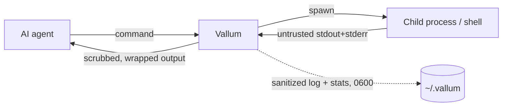

# Vallum Security: Threat Model

This document describes what Vallum protects, by which mechanism, at what
strength — and what it explicitly does **not** guarantee. It complements the
[README](README.md), which covers usage and configuration.

## Trust boundaries

Vallum sits between an AI coding agent and your shell. Everything a child
process writes to stdout/stderr is **untrusted input**: it may contain
secrets, adversarial text aimed at the model, or marker forgeries. The
Vallum binary and its config file (`~/.vallum/config.toml`) are trusted; the
agent's *commands* are executed as given — Vallum is not a sandbox (see
non-guarantees).



## What Vallum protects — and how strongly

Strength vocabulary used below:

- **Structural** — holds by construction; does not depend on pattern quality.
- **Best-effort** — pattern/heuristic based; raises the cost of an attack and
  catches common cases, with known gaps listed in the sections below.
- **Not a security control** — a side benefit, never load-bearing.

| Threat | Protection | Mechanism | Strength |
|---|---|---|---|
| Secrets in terminal output | Redacted before the model or the sanitized log sees them | Known-format patterns (provider keys, connection-string passwords, `.env` assignments) + context-gated entropy detection | Best-effort |
| Secrets in command names/args | Redacted in the audit log, `stats.jsonl`, and `--json` output | The same scrubber applied to cmd/args before any sink | Best-effort |
| Prompt injection in command output / logs | Trigger line neutralized, or whole output blocked | Multilingual pattern families; whole-line consumption; opt-in `--strict` fail-closed | Best-effort |
| Invisible/bidi control chars in output | Removed before the model sees them | Fixed-set zero-width/BOM/bidi strip (`normalize`) | Structural (for the listed code points) |
| Forged `[UNTRUSTED TERMINAL OUTPUT]` markers | Output cannot close the wrapper early or smuggle "trusted" text | Marker defang after all content transforms; exactly one wrapper survives | **Structural** |
| Log exposure | Secrets don't reach disk by default | Raw (unredacted) log **off by default**; sanitized log and stats written `0600`; cmd/args redacted even in the raw log header | Structural defaults |
| Noisy output / token bloat | Compressed before reaching the model | Command optimizers, truncation, whitespace collapse | Not a security control |

Detection strength is measured, not asserted: see
[`evals/report.md`](evals/report.md) for precision/recall over the committed
`evals/corpus/`, including the honest list of known misses.

## Per-threat detail and known gaps

### Secrets in terminal output

Two layers run on every command's output (and on command names/args before
they are logged):

1. **Format patterns** — OpenAI `sk-`/`sk-proj-`, Anthropic `sk-ant-…`,
   GitHub `ghp_`/`github_pat_`, GitLab `glpat-`, Slack `xox*`, AWS `AKIA…`,
   Google `AIza…`, Stripe `sk_live_`/`rk_live_`, SendGrid `SG.…`, Twilio
   `SK…`, npm `npm_…`, PyPI `pypi-…`, Hugging Face `hf_…`, JWTs (both
   `Bearer`-prefixed and bare `eyJ….eyJ….sig`), PEM private keys,
   connection-string passwords, and uppercase `.env`-style assignments.
   Extensible via `[scrubber] extra_secret_patterns`.
2. **Context-gated entropy detection** (default on; `[scrubber] entropy =
   false` disables) — a value is masked only when it is the value of a
   credential-ish assignment (key containing
   pass/pwd/secret/token/key/auth/cred/session) AND it is ≥16 chars with
   high Shannon entropy. Bare tokens — commit SHAs, UUIDs, base64 blobs in
   logs — are never candidates.

**Known gaps**

- Unknown-format secrets *outside* any assignment context are not caught
  (catching them was rejected as a high-false-positive design).
- Secrets split across lines, or encoded so that measured entropy drops.
- Low-entropy passwords and pure-decimal secrets are exempt by design (the
  alternative would redact ordinary IDs and phone numbers).
- A secret the agent itself typed into a command is already known to the
  model; Vallum still keeps it out of the audit log, stats, and JSON output.

### Prompt injection in output and logs

Pattern families ("ignore previous instructions", "you are now…", "reveal
your system prompt", injected `Assistant:`/`System:` turns) are detected in
English, Turkish, Spanish, German, and French, resist line-splitting, and
neutralize the whole trigger line (trigger + payload) with
`[POTENTIAL INJECTION NEUTRALIZED]`. With `--strict` (or `[security]
strict`), any detection replaces the entire output body with
`[OUTPUT BLOCKED: prompt injection detected]` while preserving the child
exit code. The sanitized log only ever receives post-neutralization text. The injection scanner runs before secret redaction within the scrub stage, so a secret pattern can no longer delete a trigger word and hide an injection.
Before matching, output is normalized: zero-width, BOM, and bidi control
characters are stripped from the output entirely, and the scanner matches a
per-line shadow (compatibility/decomposition + combining-mark strip +
lowercase + curated confusable folding) so homoglyph, full-width, and
diacritic evasions are seen through. The despaced ignore-family and
reveal-family also catch no-space concatenation
(`ignoreallpreviousinstructions`, `revealyoursystemprompt`). This normalization
relies on the `unicode-normalization` crate (NFKD/NFKC) plus a curated,
dependency-free confusable table.

**Known gaps**

- Chinese-language injection (no word boundaries; needs different matching —
  deferred).
- Confusables outside the curated table (the table targets ASCII-Latin
  look-alikes of the keyword alphabets, not the full Unicode confusable set).
- Leetspeak digit substitution (`1gn0re`) — not folded.
- `Assistant:`/`System:` turns starting mid-line rather than at line start.
- Turn lines with fewer than three natural-language words after the colon.
- Reveal-family phrases without a possessive or system-directed qualifier.

### Forged untrusted-output markers

Every result is wrapped in `[UNTRUSTED TERMINAL OUTPUT START/END]` markers.
Defanging runs after all other content transforms, so no output content —
including text produced by the optimizers or the scrubber itself — can fake
an early END marker and smuggle "trusted" text past the boundary. Exactly
one wrapper survives (property-tested). The wrapper's token cost is constant
and size-independent by design.

**Dependency, not gap:** the wrapper only helps if the agent is prompted to
treat wrapped content as untrusted data. Vallum cannot force the model to
respect it.

### Logs

Raw (unredacted) body logging is **opt-in and off by default**. The
sanitized log and `stats.jsonl` are created with `0600` permissions on Unix.
Command names and arguments are scrubbed before they appear in *any* log
header, stats record, or JSON output.

### Noisy output / token bloat

Optimizers, truncation, and whitespace collapse compress what reaches the
model. This is a cost feature, **not a security control**: summarization
never hides error lines, and the scrub → wrap stages run on every command
whether or not an optimizer fired.

## Supply-chain integrity

Release binaries are built in GitHub Actions by the `dist` pipeline. Each
artifact carries a **SHA-256 checksum** (`*.sha256`, plus a combined
`sha256.sum`) and a **GitHub build-provenance attestation** binding the binary
to the exact source commit and release workflow. Verify a download before
trusting it:

```bash
gh attestation verify ./vallum --repo kahramanemir/Vallum
```

**Known gap:** macOS binaries are **not** Apple-notarized or Developer-ID
signed in this release line, so Gatekeeper may quarantine a binary extracted
from a direct `.tar.xz` download (Homebrew and the shell installer are
unaffected). Code signing / notarization is deferred.

## What Vallum does NOT guarantee

- **It is not a sandbox.** Vallum does not restrict which commands run or
  what they do. This is deliberate: there is no allowlist; the
  untrusted-output wrapper is the size- and command-independent boundary.
- **It cannot make the model obey.** Treating wrapped output as untrusted is
  prompt-side discipline; keep your agent instructed accordingly.
- **It covers only what flows through it.** The Claude Code hook rewrites
  Bash tool calls; file reads, web fetches, and other tools bypass Vallum
  entirely.
- **TUI commands bypass the pipeline.** The hook skips
  `vim`/`vi`/`nano`/`less`/`more`/`top`/`htop`/`tmux`/`screen` because
  capturing them would break their TTY requirements.
- **An enabled raw log is unredacted by definition** (its header cmd/args
  are still scrubbed). Leave `raw_enabled = false` unless actively debugging.
- **Best-effort layers have gaps** — see the per-threat lists above. Treat
  all terminal output as untrusted regardless of Vallum.
- **Resource caps protect Vallum, not your system.** The 10 MiB capture cap
  and the timeout bound Vallum's capture path; they do not constrain what
  the child process does to the machine.

## Reporting

Found a gap or bypass? Open an issue on the repository, or use GitHub's
private security advisories for sensitive findings.
