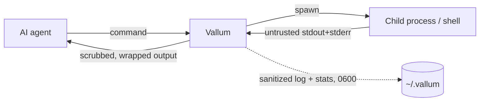

# Vallum Security: Threat Model

This document describes what Vallum protects, by which mechanism, at what
strength — and what it explicitly does **not** guarantee. It complements the
[README](README.md), which covers usage and configuration.

## Trust boundaries

Vallum sits between an AI coding agent and your shell. Everything a child
process writes to stdout/stderr is **untrusted input**: it may contain
secrets, adversarial text aimed at the model, or marker forgeries. The
Vallum binary and its config file (`~/.vallum/config.toml`) are trusted; the
agent's *commands* are executed as given — Vallum is not a sandbox (see
non-guarantees).



## What Vallum protects — and how strongly

Strength vocabulary used below:

- **Structural** — holds by construction; does not depend on pattern quality.
- **Best-effort** — pattern/heuristic based; raises the cost of an attack and
  catches common cases, with known gaps listed in the sections below.
- **Not a security control** — a side benefit, never load-bearing.

| Threat | Protection | Mechanism | Strength |
|---|---|---|---|
| Secrets in terminal output | Redacted before the model or the sanitized log sees them | Known-format patterns (provider keys, connection-string passwords, `.env` assignments) + context-gated entropy detection | Best-effort |
| Secrets in command names/args | Redacted in the audit log, `stats.jsonl`, and `--json` output | The same scrubber applied to cmd/args before any sink | Best-effort |
| Prompt injection in command output / logs | Trigger line neutralized, or whole output blocked | Multilingual pattern families; whole-line consumption; opt-in `--strict` fail-closed | Best-effort |
| Invisible/bidi control chars in output | Removed before the model sees them | Fixed-set zero-width/BOM/bidi strip (`normalize`) | Structural (for the listed code points) |
| Forged `[UNTRUSTED TERMINAL OUTPUT]` markers | Output cannot close the wrapper early or smuggle "trusted" text | Marker defang after all content transforms; exactly one wrapper survives | **Structural** |
| Log exposure | Secrets don't reach disk by default | Raw (unredacted) log **off by default**; sanitized log and stats written `0600`; cmd/args redacted even in the raw log header | Structural defaults |
| Noisy output / token bloat | Compressed before reaching the model | Command optimizers, truncation, whitespace collapse | Not a security control |
| Accidental / dangerous command execution | Command is prompted on (`Ask`) or refused (`Deny`) before it runs | Pre-exec guardrail: plain-text pattern rules over the joined command line → Allow/Ask/Deny (default on, built-ins all `Ask`) | Best-effort |

Detection strength is measured, not asserted: see
[`evals/report.md`](evals/report.md) for precision/recall over the committed
`evals/corpus/`, including the honest list of known misses.

## Per-threat detail and known gaps

### Secrets in terminal output

Two layers run on every command's output (and on command names/args before
they are logged):

1. **Format patterns** — OpenAI `sk-`/`sk-proj-`, Anthropic `sk-ant-…`,
   GitHub `ghp_`/`github_pat_`, GitLab `glpat-`, Slack `xox*`, AWS `AKIA…`,
   Google `AIza…`, Stripe `sk_live_`/`rk_live_`, SendGrid `SG.…`, Twilio
   `SK…`, npm `npm_…`, PyPI `pypi-…`, Hugging Face `hf_…`, Slack incoming
   webhooks, Discord/Telegram bot tokens, DigitalOcean `dop_v1_…`, Shopify
   `shp*_…`, Azure Storage `AccountKey=…`, Sentry DSNs, age secret keys
   (`AGE-SECRET-KEY-1…`), Google OAuth (`ya29.`/`GOCSPX-`), Stripe webhook
   secrets (`whsec_`), GitHub OAuth/app tokens (`gho_`/`ghu_`/`ghs_`/`ghr_`),
   New Relic keys (`NRAK-`/…), Supabase `sbp_…`, Doppler `dp.st.…`, Linear
   `lin_api_…`, Figma `figd_…`, Postman `PMAK-…`, Databricks `dapi…`, JWTs
   (both `Bearer`-prefixed and bare `eyJ….eyJ….sig`), PEM private keys,
   connection-string passwords, and uppercase `.env`-style assignments.
   Extensible via `[scrubber] extra_secret_patterns`.
2. **Context-gated entropy detection** (default on; `[scrubber] entropy =
   false` disables) — a value is masked only when it is the value of a
   credential-ish assignment (key containing
   pass/pwd/secret/token/key/auth/cred/session) AND it is ≥16 chars with
   high Shannon entropy. Bare tokens — commit SHAs, UUIDs, base64 blobs in
   logs — are never candidates.

**Known gaps**

- Unknown-format secrets *outside* any assignment context are not caught
  (catching them was rejected as a high-false-positive design).
- Secrets split across lines, or encoded so that measured entropy drops.
- Low-entropy passwords and pure-decimal secrets are exempt by design (the
  alternative would redact ordinary IDs and phone numbers).
- A secret the agent itself typed into a command is already known to the
  model; Vallum still keeps it out of the audit log, stats, and JSON output.

### Prompt injection in output and logs

Pattern families ("ignore previous instructions", "you are now…", "reveal
your system prompt", DAN/persona jailbreaks, injected `Assistant:`/`System:`
turns, plus escalation banners ("IMPORTANT!!! ignore…" / "strictly adhere to
the following instruction"), covert-action markers ("do not tell the user",
"hide this from the user"), data-exfiltration imperatives (send/email a
credential-ish object to an external address/URL), forged chat-template /
tool-call scaffolding (`<|im_start|>system`, `[INST]`, `<<SYS>>`,
`<tool_call>`, Alpaca `### Instruction:` headers), and invisible-markup
injections (an instruction hidden via `display:none`/`opacity:0` CSS)) are
detected across English,
Turkish, Spanish, German, French, Chinese, Japanese, Korean, Russian, Arabic,
Portuguese, Italian, Dutch, and Hindi (coverage varies by family), resist
line-splitting, and neutralize the whole trigger line (trigger + payload) with
`[POTENTIAL INJECTION NEUTRALIZED]`. With `--strict` (or `[security]
strict`), any detection replaces the entire output body with
`[OUTPUT BLOCKED: prompt injection detected]` while preserving the child
exit code. The sanitized log only ever receives post-neutralization text. The injection scanner runs before secret redaction within the scrub stage, so a secret pattern can no longer delete a trigger word and hide an injection.
Before matching, output is normalized: zero-width, BOM, and bidi control
characters are stripped from the output entirely, and the scanner matches a
per-line shadow (compatibility/decomposition + combining-mark strip +
lowercase + curated confusable folding) so homoglyph, full-width, and
diacritic evasions are seen through. The despaced ignore-family and
reveal-family also catch no-space concatenation
(`ignoreallpreviousinstructions`, `revealyoursystemprompt`). This normalization
relies on the `unicode-normalization` crate (NFKD/NFKC) plus a curated,
dependency-free confusable table.

**Known gaps**

- The escalation/covert-action/exfiltration/scaffolding/hidden-markup families
  are English-only so far (the override/reveal families are multilingual).
- Invisible-markup detection is line-local: an instruction hidden across
  multiple lines of un-minified HTML (hiding technique and directive on
  different lines) is not correlated.
- Confusables outside the curated table (the table targets ASCII-Latin
  look-alikes of the keyword alphabets, not the full Unicode confusable set).
- Leetspeak digit substitution (`1gn0re`) — not folded.
- `Assistant:`/`System:` turns starting mid-line rather than at line start.
- Turn lines with fewer than three natural-language words after the colon.
- Reveal-family phrases without a possessive or system-directed qualifier.

### Forged untrusted-output markers

Every result is wrapped in `[UNTRUSTED TERMINAL OUTPUT START/END]` markers.
Defanging runs after all other content transforms, so no output content —
including text produced by the optimizers or the scrubber itself — can fake
an early END marker and smuggle "trusted" text past the boundary. Exactly
one wrapper survives (property-tested). The wrapper's token cost is constant
and size-independent by design.

**Dependency, not gap:** the wrapper only helps if the agent is prompted to
treat wrapped content as untrusted data. Vallum cannot force the model to
respect it.

### Logs

Raw (unredacted) body logging is **opt-in and off by default**. The
sanitized log and `stats.jsonl` are created with `0600` permissions on Unix.
Command names and arguments are scrubbed before they appear in *any* log
header, stats record, or JSON output.

### Noisy output / token bloat

Optimizers, truncation, and whitespace collapse compress what reaches the
model. This is a cost feature, **not a security control**: summarization
never hides error lines, and the scrub → wrap stages run on every command
whether or not an optimizer fired.

### Dangerous command execution (guardrail)

Before a command runs, Vallum evaluates the **joined command line** against a
narrow set of pattern rules and returns Allow / Ask / Deny (most-severe-wins).
The guardrail is on by default; every built-in rule is `Ask`, so a matched
command prompts for confirmation rather than being blocked outright. Built-ins
cover `rm -rf` on a root/home/system path, `curl … | sh`, remote-fetch-and-exec,
`dd`/redirect/`mkfs` to a block device, the classic fork bomb, recursive
`chmod 777`, reading private keys / credential files / `/etc/shadow`,
`git push --force`, `find -delete`/`shred`/`truncate`/`xargs rm` on sensitive
targets, reverse shells (`/dev/tcp`, `nc -e`, `socat exec:`), `git clean -f`,
and recursive `chown` on a system path. Users can add `ask`/`deny` rules under
`[policy]`.

**Enforcement points.** The same Allow/Ask/Deny decision core is reached from
five call sites: direct `vallum run`, and four native pre-exec hooks — Claude
Code `PreToolUse`, Cursor `beforeShellExecution`, Gemini CLI `BeforeTool`, and
Codex CLI `PreToolUse`. Only the Claude Code hook rewrites the command through
`vallum run` (full capture/scrub/optimize/wrap pipeline); the Cursor, Gemini
CLI, and Codex CLI hooks gate the command (Allow/Ask/Deny) but do not rewrite
it or run it through the output pipeline. Two principles hold across all four
hooks:

- **P1 — Allow never overrides the agent.** On Cursor, Gemini CLI, and Codex
  CLI, an Allow verdict emits *no decision at all*, so whatever native
  approval flow the agent itself has still runs; Vallum's hook only ever adds
  friction on top, never removes it.
- **P2 — Ask fails closed where there is no native ask.** Claude Code and
  Cursor expose a native "ask the user" decision; Gemini CLI and Codex CLI do
  not. On those two, an `Ask` verdict is enforced as a **Deny**, with a reason
  that names the escape hatches — run it yourself with
  `vallum run -- bash -c '<cmd>'` (the same `bash -c` wrapping the Claude hook
  applies, so a piped/compound command like `curl … | sh` stays gated as one
  unit instead of splitting across your own shell), or turn the rule off: for
  a built-in, `[policy] disabled = ["<rule>"]`; for a user-defined rule
  (named `user:<pattern>`, which `[policy] disabled` cannot touch), edit or
  remove the matching `[[policy.rules]]` entry in your config instead.
  Emitting no decision instead would silently become *allow* under an
  agent's auto-approve mode, which is unacceptable for a security control.

Every Ask/Deny verdict, on any of the five call sites, is still recorded
(redacted) to `policy.log`, and the line now names which surface produced it:
`agent=claude|cursor|gemini|codex|direct`.

**Strength: best-effort.** This raises the cost of an *accidental* destructive
command and gives the model (or you) a confirmation checkpoint — it is **not a
sandbox**.

**Known gaps**

- Matching is **plain-text over the command string** — no shell parsing, no
  path resolution, no variable/alias expansion. A determined author can evade a
  rule by obfuscation (unusual quoting, indirection, alternate tools,
  base64-then-decode). The built-ins target the *common, obvious* forms.
- Rules are deliberately **narrow to preserve precision** (a committed
  benign-command gate keeps them from firing on legitimate commands), so they
  under-match rather than risk nagging — they are not an exhaustive catalog of
  dangerous commands.
- **Path-aware matching is deferred:** the guardrail cannot tell
  `rm -rf ./build` from `rm -rf /` beyond the literal patterns encoded today.
- **Codex CLI does not intercept every shell call.** Per Codex's own hooks
  documentation: "This doesn't intercept all shell calls yet, only the simple
  ones. The newer `unified_exec` mechanism allows richer streaming
  stdin/stdout handling of shell, but interception is incomplete. Similarly,
  this doesn't intercept `WebSearch` or other non-shell, non-MCP tool calls."
  A command Codex never routes through the hook reaches the shell with no
  Vallum verdict at all — logged or otherwise. See the README's
  [Multi-agent guardrail](README.md#multi-agent-guardrail) section for the
  source link.
- **Codex CLI skips untrusted hooks silently (fail-open until trusted).**
  Codex only runs a hook after its exact definition has been reviewed and
  trusted once (Codex TUI review flow, or `--dangerously-bypass-hook-trust`
  for automation); an installed-but-untrusted hook is skipped with no warning
  and gated commands execute unguarded. This trust state lives inside Codex
  and is invisible to Vallum — `vallum install-hook --agent codex` succeeding
  and `vallum doctor` reporting "installed" do **not** imply enforcement.
  Hook-trust handling in `codex exec` was fixed in codex-cli 0.141.0
  (openai/codex#26434); on 0.139 the hook never fired at all in our tests.
  Enforcement verified live on codex-cli 0.142.5 (2026-07-08). After
  installing (or upgrading Codex), verify with a known-Ask command and expect
  a deny.
- **A hook entry that invokes bare `vallum` no-ops silently.** Bare
  `vallum` (no subcommand) prints a welcome screen and exits 0, so a
  hand-edited hook entry missing the `hook` subcommand does not fail
  closed — the agent treats the output as informational and runs the
  command ungated. (Before the welcome screen existed it exited 2, which
  blocked every command — a loud misconfiguration.) `vallum install-hook`
  never writes this shape, and `vallum doctor` reports it as "not
  installed". After hand-editing any hook config, verify with a known-Ask
  command and expect a prompt or deny.
- **TUI-headed commands are evaluated but never rewritten.** Commands whose
  first word is `vim`, `vi`, `nano`, `less`, `more`, `top`, `htop`, `tmux`,
  or `screen` go through the same policy evaluation as everything else —
  `less /etc/shadow` asks (Claude Code, Cursor) or is denied with
  instructions (Gemini CLI, Codex CLI). What the TUI list changes is the
  *rewrite*: a clean Allow passes the command through untouched, and an
  approved Ask on Claude Code runs the original command directly — in both
  cases the interactive TTY is preserved and the command's *output* does not
  go through Vallum's sanitization pipeline (it never did for any
  passed-through command). Direct `vallum run` is unaffected.
- Setting `security.guardrail = false` disables the layer entirely (Vallum then
  behaves exactly as it did before it existed).

### Guardrail wrapper coverage

The pre-exec guardrail matches against the raw command **and** a bounded set of
precision-safe views that surface a wrapped or encoded inner command:

- POSIX shell `-c` arguments (`bash`/`sh`/`zsh`/`dash`/`ksh`), bare or bundled
  (`bash -c '…'`, `bash -xc '…'`), including wrapper prefixes
  (`sudo`/`env`/`timeout`/`FOO=bar bash -c '…'`) and nesting up to depth 3
- `eval` arguments
- `base64 -d` / `--decode` payloads (decoded and re-checked)
- `$IFS` / `${IFS}` token-separator splitting
- word-internal quote splitting (`r'm'`), escaped spaces (`rm\ -rf`), and the
  same splitting applied to the interpreter verb itself (`\bash -c '…'`,
  `b''ash -c '…'`)
- whole-token quote / backslash removal, brace-list expansion (`/{bin,etc}`),
  and trailing-`/.` collapse on the command before matching, so a rule's anchor
  token cannot be hidden by quoting the path (`rm -rf "/"`), quoting a flag
  (`chmod "-R" 777 /`), escaping it (`rm -rf \/`), brace-listing it
  (`rm -rf /{bin,etc,usr}`), or writing `/.`. A quoted span that contains
  whitespace (`echo "rm -rf /"`) is never unquoted, so a benign mention stays
  benign
- ANSI-C / locale `$'…'` / `$"…"` quotes are de-prefixed (`bash -c $'rm -rf /'`
  unwraps), path-qualified interpreters are matched by basename (`/bin/bash -c
  '…'`, `curl … | /usr/bin/sh`), and `source`/`.` executing a process
  substitution (`source <(curl …)`) is recognized
- newlines are treated as command separators, so a print-led first line does
  not mask an interpreter on the next line

**Known limitation (by design):** the guardrail is defense-in-depth, not a
shell sandbox. Distinguishing a safe sink (`echo "rm -rf /"`, which only prints
the string) from an executed context in *every* case would require full
shell-verb sink analysis, which would cost precision. Several classes can still
get through: **non-shell interpreters** are not unwrapped — a payload passed to
`python -c`, `perl -e`, or `node -e` is opaque to the matcher; the interpreter
name can be **assembled from a variable** (`X=rm; $X -rf /`); it can be hidden
inside a **command substitution** that is not split out (`echo $(bash -c 'rm -rf
/')`, `` `bash -c '…'` ``, `$(printf …)`); or introduced by a **command
separator glued to the surrounding words** so the wrapped interpreter reads as
one token (`echo x;bash -c 'rm -rf /'`, where `x;bash` is not split). A literal
command **fed to a shell through a pipe or here-string** rather than a `-c`
argument (`echo 'rm -rf /' | sh`, `bash <<< 'rm -rf /'`, `… | xargs bash -c`) is
likewise opaque — the dangerous text is data on the interpreter's stdin, not a
matchable argument — as is a wrapped command hidden inside a single combined
token (`env -S "bash -c 'rm -rf /'"`). Built-in rules are `Ask`, not `Deny`, and
the guardrail is one layer — not a guarantee.

### Agent-config self-protection

Vallum defends the agent config/hook files it manages with two complementary
checks, both reusing the existing engines (no new detection logic):

- **Write guardrail (`write_agent_config`):** Asks before a shell write-verb
  (redirect, `tee`, `dd of=`, `sed -i`, `cp`/`mv`/`install` to a destination)
  targets a protected config/hook file (`.claude/settings.json`,
  `.claude/settings.local.json`, `.cursor/hooks.json`, `.codex/hooks.json`,
  `.codex/config.toml`, `.gemini/settings.json`, `.mcp.json`). Reads and
  copies *from* these files never fire. It does **not** see non-shell writers
  (`python -c 'open(...,"w")'`), a variable-assembled path, or a `cp` whose
  destination is not the final token — fail-safe, same scope as the rest of
  the guardrail. Vallum's own `install-hook` writes via Rust `std::fs`, so it
  never triggers.
- **Doctor hook-audit:** `vallum doctor` inspects the four JSON agent hook
  configs (user-level), lists foreign hook commands — any it did not install —
  as a Warn, and fails (`✗`, non-zero exit) on one matching a dangerous
  guardrail pattern (curl-pipe-shell, reverse shell, …). Displayed commands
  are redacted through the secret scrubber first. It is a static,
  pattern-based, pull check (the user must run `vallum doctor`); it does not
  watch files, cover project-level Claude settings, or audit `.mcp.json`
  server definitions (that is `vallum mcp scan`).

### Tamper-evident audit log (policy.log hash chain)

Every Ask/Deny block appended to `policy.log` carries a `Chain:` line —
`SHA256(previous_hash ++ block_body)`, genesis-anchored. `vallum log verify`
recomputes the chain and reports the first break; `vallum doctor` runs the
same check (`log-chain`, broken → ✗ non-zero exit). Appends are serialized
with an exclusive `flock`, entries are single-lined so logged commands cannot
inject fake chain/delimiter lines, and the payload is already redacted by the
secret scrubber before hashing.

Honest limits:

- **Tail truncation is invisible to the chain alone** — deleting the last N
  blocks leaves a self-consistent shorter chain. `vallum log verify` prints
  the head hash on every successful verify; store it outside the machine (password
  manager, another host) and pass it back via `--expect-head` to catch
  truncation and full-file rewrites. Absence alone is not treated as tamper
  evidence (a machine that has never logged a verdict has no chain), but
  `--expect-head` against a missing log **does** fail (exit 20) — full
  deletion is the easiest truncation, and the anchor exists to catch it.
- An attacker with write access and knowledge of the scheme can **recompute
  the whole chain** (there is no secret key — a same-host key would be
  readable by the same attacker). The chain is tamper-*evident* against
  in-place edits, not tamper-*proof*; the external anchor closes the gap.
- Blocks written before this feature (no `Chain:` line) are legacy:
  unverifiable and outside chain coverage.

### Blast-radius circuit breaker

The guardrail rules gate one command at a time; the circuit breaker watches
the *rate*. Five Ask/Deny verdicts inside 60 seconds (defaults; `[security]`
tunable) trip a machine-wide lock: every subsequent command — including ones
the guardrail would allow — is denied for the cooldown (300s) or until
`vallum unlock`. The verdict that trips the breaker is returned unchanged;
lockdown starts with the next command. Trips are logged to the hash-chained
`policy.log` (`rule_name = circuit_breaker`) — when `[audit] sanitized_enabled`
is on (the default); with it off the breaker still trips and locks, but writes
no forensic line. `vallum`-headed commands keep
their pass-through so `vallum unlock` stays reachable — a wrapped
`vallum run` still re-enters the policy (and the trip check) in the child
process.

Honest limits:

- The state file (`~/.vallum/logs/breaker.state`) shares the config file's
  trust boundary: an attacker with filesystem write access can delete or
  edit it. The breaker is a brake on runaway **agent behavior**, not an
  on-host tamper-proof control.
- The window is machine-global, not per-agent-session: agents running in
  parallel share the counter (deliberate — the blast radius being limited
  is the machine's).
- Counting is best-effort: if the state file cannot be written, verdicts
  still stand but the breaker may undercount.

### Approval tokens (hook → `vallum run`)

In hook mode the Claude codec is the single point of policy enforcement: it
evaluates a command once, and on approval re-wraps it as
`vallum run --approval-token <hmac> -- bash -c '<original>'`. The token is an
HMAC-SHA256 over the exact command line, keyed by a machine-local secret
(`~/.vallum/logs/approval.secret`, mode 0600, generated on first use). `vallum
run` recomputes the HMAC and skips re-evaluation only when the token matches.

This prevents an agent from asserting its own bypass: a forged or injected
`vallum run --approval-token … -- …` cannot produce a valid token without the
secret, so it is re-gated by the guardrail (and the circuit breaker).

**Boundary (honest):** the token stops an agent from *forging* a bypass — it
cannot compute a valid HMAC for a command without the secret. It is **not** a
defense against an agent that can *read* the secret: a process running as the
same user with no sandbox can read `approval.secret` and mint valid tokens, and
Vallum does not defend against that, because on the same machine there is no
cryptographic boundary between your files and a process you launched. Confining
the agent so it cannot read arbitrary files is the operating-system sandbox's
job (roadmap item #1), not the guardrail's.

The token is bound to one exact command, so observing a rewritten command never
helps forge a *different* one — but the two rewrite paths differ in what a
replay of the *same* token buys:

- For an **Allowed** command, replaying its token only re-runs a command that
  was allowed anyway — harmless.
- For an **Ask** command, the hook mints the token *before* the user decides
  (so an approved Ask can run without being double-gated and failing closed).
  Replaying that token would skip the user's prompt, so this path's safety
  relies on the agent never seeing the rewritten command: Claude Code does not
  surface a `PreToolUse` hook's `updatedInput` back to the model. Treat that as
  defense-in-depth, not a cryptographic guarantee.

## MCP configuration scanning

`vallum mcp scan` is a **static, read-only** check over MCP server
configuration files. It discovers the well-known config locations (plus any
explicit path arguments), parses the server definitions, and runs three
existing engines over them: the secret scrubber on each server's `env` values,
the guardrail policy engine on each server's launch command, and the injection
detector on any tool-description text written into the config. It connects to
no server, launches no process, and modifies no file.

**What it catches:** plaintext credentials embedded in a server's `env`, a
server whose launch command matches a dangerous pattern (`curl … | sh` and the
guardrail's other rules), and prompt-injection phrasing in descriptions stored
in the config. Exit codes are `0` clean, `10` warning-class findings, `20`
high-severity (only reachable with a user-defined `deny` rule — every built-in
rule is `Ask`, i.e. warning-class), and `125` for a usage/read error.

**What it does NOT cover, stated plainly:**

- **Runtime tool descriptions are invisible to it.** Most MCP servers supply
  their tool list and descriptions at connection time via `tools/list`, not in
  the config file. A static scan sees only descriptions literally written into
  the config; the classic tool-poisoning payload delivered by a live server is
  out of scope until a future live-introspection mode is added.
- **It is pattern-based.** The injection check inherits the injection
  detector's measured recall, and the launch-command check inherits the
  guardrail's precision-safe matching and its documented wrapper limitations —
  it is a speed bump, not a proof.
- **It connects to nothing, so it cannot see behavior.** A server that is
  benign in its config but malicious at runtime (a "rug pull"), or whose risk
  lives in code rather than metadata, is not something a static config scan can
  detect.
- **It only looks where it knows to look** — the built-in well-known config
  locations plus paths you pass explicitly. A server configured somewhere else
  is not scanned unless you name its file.
- **Within a scanned file, it reads only top-level server maps** (`mcpServers`
  / `servers`, or Codex's `[mcp_servers]`). Servers nested elsewhere — for
  example project-scoped entries under `projects.<dir>.mcpServers` in
  `~/.claude.json` — are not parsed in this version, so a file can be
  discovered and read yet still have servers the scan does not see.

## Skill & context-file scanning

`vallum skills scan` is the Markdown sibling of the MCP scan: a **static,
read-only** check over agent skill files (`SKILL.md`) and agent context files
(`CLAUDE.md`, `AGENTS.md`, `GEMINI.md`, `.cursorrules`, `*.mdc`,
`copilot-instructions.md`). It reuses the secret scrubber (per line), the
injection detector (whole text), the guardrail policy engine (shell-language
fenced code and inline backtick spans), and the output normalizer's
invisible-code-point set. A document carrying **both** an injection finding
**and** a risky-command finding — the pattern Snyk's ToxicSkills audit
measured in 91% of confirmed-malicious skills — is escalated to one
high-severity composite finding. **Strength: best-effort**, with the same
measured detection limits as the underlying engines (see
[`evals/report.md`](evals/report.md)).

**What it does NOT cover, stated plainly:**

- **Static only.** It scans bytes on disk, not what an agent actually ingests
  at runtime. A skill that rewrites itself, fetches remote instructions, or is
  redefined after approval (a "rug pull") is out of scope.
- **Text only.** Instructions hidden in images or other binary assets are not
  analyzed (cf. "Seeing Is Not Screening", arXiv 2606.18198).
- **Markdown is handled heuristically**, not via a spec-complete parser;
  exotic fence nesting may be over- or under-scanned. The design errs toward
  over-scanning (an inline-code false positive) rather than missing a command.
- The invisible-Unicode check covers the same fixed code-point set as the
  output normalizer, not the full Unicode confusable space.
- **Security documentation looks malicious.** A document that *quotes* attacks
  — injection example phrases in prose plus dangerous commands in code blocks,
  like Vallum's own README — is indistinguishable from a poisoned skill to a
  static scanner and triggers the composite high-severity finding. This is the
  measured ToxicSkills signature working as designed; review such findings in
  context rather than suppressing them.

## Supply-chain integrity

Release binaries are built in GitHub Actions by the `dist` pipeline. Each
artifact carries a **SHA-256 checksum** (`*.sha256`, plus a combined
`sha256.sum`) and a **GitHub build-provenance attestation** binding the binary
to the exact source commit and release workflow. Verify a download before
trusting it:

```bash
gh attestation verify ./vallum --repo kahramanemir/Vallum
```

**Known gap:** macOS binaries are **not** Apple-notarized or Developer-ID
signed in this release line, so Gatekeeper may quarantine a binary extracted
from a direct `.tar.xz` download (Homebrew and the shell installer are
unaffected). Code signing / notarization is deferred.

## What Vallum does NOT guarantee

- **It is not a sandbox.** The guardrail prompts on (`Ask`) or refuses
  (`Deny`) a *narrow, pattern-matched* set of dangerous commands — best-effort
  and evadable by obfuscation (see the guardrail section). It is not an
  allowlist and does not otherwise restrict what a command does; anything it
  does not match runs as given, and it can be turned off entirely
  (`security.guardrail = false`).
- **It cannot make the model obey.** Treating wrapped output as untrusted is
  prompt-side discipline; keep your agent instructed accordingly.
- **It covers only what flows through it.** The Claude Code hook rewrites
  Bash tool calls through the full output pipeline; the Cursor, Gemini CLI,
  and Codex CLI hooks gate commands but never see or rewrite their output.
  On every agent, file reads, web fetches, and other non-shell tools bypass
  Vallum entirely — and on Codex CLI specifically, even some shell calls do
  (see the guardrail's known gaps above).
- **TUI commands bypass the output pipeline.** The hook does not rewrite
  `vim`/`vi`/`nano`/`less`/`more`/`top`/`htop`/`tmux`/`screen` (to preserve
  their TTY interaction), but they are still policy-gated beforehand.
- **An enabled raw log is unredacted by definition** (its header cmd/args
  are still scrubbed). Leave `raw_enabled = false` unless actively debugging.
- **Best-effort layers have gaps** — see the per-threat lists above. Treat
  all terminal output as untrusted regardless of Vallum.
- **Resource caps protect Vallum, not your system.** The 10 MiB capture cap
  and the timeout bound Vallum's capture path; they do not constrain what
  the child process does to the machine.

## Reporting

Found a gap or bypass? Open an issue on the repository, or use GitHub's
private security advisories for sensitive findings.
