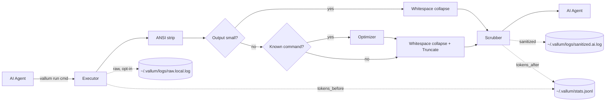

# Architecture

> Part of the [Vallum](../README.md) documentation. See also:
> [Guardrail & policy](guardrail.md) · [Output optimizers](optimizers.md) ·
> [SECURITY.md](../SECURITY.md) for the full threat model.

## Why Vallum exists

When an AI agent runs shell commands on your behalf, the command output flows
straight into the model's context. That output is **untrusted input**, and it
creates three problems:

- It may contain **secrets** — API keys, tokens, credentials — that get
  forwarded to the model (and possibly logged by it).
- It may contain **adversarial text** — log lines, scraped pages, or error
  messages crafted to hijack the agent ("ignore previous instructions…").
- It is **unstructured and noisy**, burying the relevant signal and inflating
  token usage.

Vallum is a single binary that puts a controlled boundary between that output
and the model. When an agent runs a command, Vallum redacts secrets,
neutralizes prompt-injection attempts, wraps the result as untrusted data,
preserves the child exit code, and audits everything — so what reaches the
model is exactly what you intend it to see. As a side benefit, it strips ANSI
noise and compresses long output, which also saves tokens.

> **Scope of the guarantees.** Secret redaction and injection neutralization
> are **best-effort, pattern-based** defenses. They raise the cost of an
> attack and catch common cases; they are not a substitute for treating all
> terminal output as untrusted. The untrusted-output wrapper is the durable
> control — keep your agent prompted to respect it.

## Pipeline

Each command flows through these stages:

1. **Execute** — `stdout` and `stderr` are captured concurrently and merged in
   arrival order. Capture is bounded by a byte cap and a timeout (see
   [Configuration](configuration.md)). `stdin` is inherited so interactive
   commands work.
2. **ANSI strip** — color and cursor-control escapes are removed.
3. **Short-circuit** — if the output is below `min_optimize_tokens`, the
   optimize and truncate stages are skipped (no point summarizing a few
   lines). The security stages below always run.
4. **Optimize** — if a registered `CommandOptimizer` matches (e.g.
   `git status`, `cargo test`, `pytest`, `npm test`), it produces a compressed
   view; otherwise the input passes through.
5. **Whitespace collapse** — runs of three or more blank lines collapse to
   one; trailing spaces are stripped.
6. **Truncate** — head/tail windows are preserved; important lines (errors,
   panics, failures) are kept **in place with surrounding context**, and
   ordinary gaps are elided.
7. **Scrub** — API tokens in 30+ known formats (OpenAI, Anthropic, GitHub,
   GitLab, Slack, AWS, Google, Stripe, Supabase, Doppler, Sentry, Databricks,
   and more), bearer/bare JWTs, connection-string passwords, and PEM private
   keys are redacted; known injection phrases are neutralized.
8. **Wrap** — output is enclosed in `[UNTRUSTED TERMINAL OUTPUT]` markers; any
   forged markers inside the content are defanged so output can't break out of
   the wrapper.
9. **Audit + Metrics** — the sanitized output is written under
   `~/.vallum/logs/` (raw logging is opt-in), and a per-command stats record
   is appended to `~/.vallum/stats.jsonl`.

## Security model

Vallum applies four mechanism families to every command, in order:
prompt-injection neutralization (multilingual, with invisible/bidi character
stripping and a homoglyph-folded detection shadow; opt-in `--strict`
fail-closed mode), secret redaction (known-format patterns plus context-gated
entropy detection), untrusted-output wrapping with marker defang, and
private-by-default logging (raw log opt-in, `0600` permissions).

Ahead of those four output-side mechanisms, an opt-outable **guardrail**
evaluates each command *before* it runs and can prompt (`Ask`) or block
(`Deny`) a narrow set of dangerous operations — see
[Guardrail & policy](guardrail.md).

**Full threat model:** see [SECURITY.md](../SECURITY.md) — what is protected,
by which mechanism, at what strength, and what is explicitly **not**
guaranteed.

## Measured detection

The scrubber is evaluated against a committed, labeled corpus in
`evals/corpus/` (113 injection payloads across 14 languages, 74 hard benign
negatives, and secret samples across several languages). Headline figures
from the latest run (full report: [`evals/report.md`](../evals/report.md)):

- Injection recall: **0.858** · precision: **1.000** · benign false-positive rate: **0.000**
- Known-format secret recall: **1.000** · entropy secret recall: **1.000**

These are measured over a fixed corpus and are **evidence, not a guarantee** —
see the honest "Known misses" list in the report. Regenerate with
`cargo run --example eval -- --write`; CI fails on regressions below the
committed floors.

## Tests

**Property tests.** The scrubber, truncator, ansi, whitespace, and optimizer
modules carry inline `proptest` invariants (no-panic, structural bounds,
idempotency) that run under the normal `cargo test`.

## Module map

| File                          | Responsibility                                       |
| ----------------------------- | ---------------------------------------------------- |
| `src/cli.rs`                  | Argument parsing (`run`, `stats`, `hook`, `install-hook`/`uninstall-hook`, `policy`, `mcp`, `log`, `unlock`, `update`, `doctor`, `config`, `completions`) |
| `src/config.rs`               | Config loading, defaults, and validation             |
| `src/executor.rs`             | Concurrent capture with byte cap, timeout, stdin; optional tee to `~/.vallum/live.log` |
| `src/ansi.rs`                 | Stripping ANSI escape sequences                      |
| `src/whitespace.rs`           | Collapsing blank-line runs, stripping trailing space |
| `src/optimizer/mod.rs`        | `CommandOptimizer` trait + dispatch registry         |
| `src/optimizer/apt.rs`        | Summary optimizer for `apt`/`apt-get install` output |
| `src/optimizer/brew.rs`       | Summary optimizer for `brew` output                  |
| `src/optimizer/cargo.rs`      | Summary optimizer for noisy `cargo` output           |
| `src/optimizer/cmake.rs`      | Probe-chatter collapsing optimizer for `cmake` output |
| `src/optimizer/docker.rs`     | Summary optimizer for `docker build`/`compose` output |
| `src/optimizer/dotnet.rs`     | Summary optimizer for `dotnet build/restore/test` output |
| `src/optimizer/file_list.rs`  | Entry-capping optimizer for `ls`/`find`/`fd`/`tree` |
| `src/optimizer/git_diff.rs`   | Summary optimizer for `git diff` output              |
| `src/optimizer/git_log.rs`    | Summary optimizer for `git log` output               |
| `src/optimizer/git_status.rs` | Summary optimizer for `git status` output            |
| `src/optimizer/go_build.rs`   | Download-chatter collapsing optimizer for `go build/mod/get` |
| `src/optimizer/go_test.rs`    | Summary optimizer for `go test` output               |
| `src/optimizer/gradle.rs`     | Summary optimizer for `gradle`/`gradlew` output      |
| `src/optimizer/grep.rs`       | Match-grouping optimizer for `rg`/`grep` output      |
| `src/optimizer/kubectl.rs`    | Healthy-row collapsing optimizer for `kubectl get` output |
| `src/optimizer/make.rs`       | Summary optimizer for `make` output                  |
| `src/optimizer/maven.rs`      | Summary optimizer for `mvn`/`mvnw` output            |
| `src/optimizer/ninja.rs`      | Progress-line collapsing optimizer for `ninja` output |
| `src/optimizer/npm.rs`        | Summary optimizer for noisy `npm` output             |
| `src/optimizer/pip.rs`        | Summary optimizer for `pip install` output           |
| `src/optimizer/poetry.rs`     | Summary optimizer for `poetry` output                |
| `src/optimizer/pytest.rs`     | Summary optimizer for noisy `pytest` output          |
| `src/optimizer/terraform.rs`  | Summary optimizer for `terraform plan`/`apply` output |
| `src/truncator.rs`            | Context-preserving head/tail truncation              |
| `src/scrubber/mod.rs`         | Scrub pipeline: `sanitize`/`redact` orchestration + wrapper |
| `src/scrubber/secrets.rs`     | Known-format secret redaction patterns               |
| `src/scrubber/entropy.rs`     | Context-gated entropy secret detection               |
| `src/scrubber/injection.rs`   | Prompt-injection neutralization                      |
| `src/scrubber/normalize.rs`   | Invisible-char strip + homoglyph detection shadow    |
| `src/scrubber/markers.rs`     | Untrusted-output marker defang                       |
| `src/policy/mod.rs`           | Pre-exec Allow/Ask/Deny policy engine + built-in rules |
| `src/policy/unwrap.rs`        | Bounded precision-safe command views (wrapper/encoding unwrap) |
| `src/policy/normalize.rs`     | Shell no-op normalization view (dequote/unescape/brace/path) |
| `src/policy/audit.rs`         | Redacted `policy.log` verdict writer                 |
| `src/approval.rs`             | Machine-local secret + per-command HMAC approval tokens (hook → `run` handshake) |
| `src/breaker.rs`              | Blast-radius circuit breaker: sliding-window trip state + unlock |
| `src/logchain.rs`             | `policy.log` SHA-256 hash chain: chained append + `log verify` |
| `src/mcp/mod.rs`              | `vallum mcp scan` orchestration                      |
| `src/mcp/discover.rs`         | Well-known MCP config file locations                 |
| `src/mcp/model.rs`            | Parsing on-disk MCP config shapes into normalized servers |
| `src/mcp/scan.rs`             | The three static checks (secrets, risky launch, injection) |
| `src/mcp/report.rs`           | Human and JSON renderers for scan reports            |
| `src/skills/mod.rs`           | `vallum skills scan` orchestration (skill/context docs + bundled aux files: binary-skip, size/UTF-8 gating) |
| `src/tokenizer.rs`            | Pluggable `TokenEstimator` + heuristic default       |
| `src/fsutil.rs`               | Private (0600) append-file helper                    |
| `src/audit.rs`                | Append-only log writer                               |
| `src/metrics.rs`              | Token estimation + JSONL stats writer                |
| `src/stats.rs`                | `vallum stats` aggregation and reporting             |
| `src/eval.rs`                 | Detection-eval engine: corpus loader, metrics, report rendering |
| `src/hook/mod.rs`             | Shared Allow/Ask/Deny decision core + stdin/stdout driver used by every agent codec |
| `src/hook/claude.rs`          | Claude Code `PreToolUse` codec: rewrites approved Bash calls to `vallum run` |
| `src/hook/cursor.rs`          | Cursor `beforeShellExecution` codec: native ask, verdicts only |
| `src/hook/gemini.rs`          | Gemini CLI `BeforeTool` codec: verdicts only, Ask fails closed |
| `src/hook/codex.rs`           | Codex CLI `PreToolUse` codec: verdicts only, Ask fails closed |
| `src/install_hook/mod.rs`     | Shared JSON read-modify-write machinery for `install-hook`/`uninstall-hook` |
| `src/install_hook/select.rs`  | Interactive multi-select agent picker (TTY only)     |
| `src/install_hook/claude.rs`  | Claude Code installer: `~/.claude/settings.json` (or `--project`) |
| `src/install_hook/cursor.rs`  | Cursor installer: `~/.cursor/hooks.json` |
| `src/install_hook/gemini.rs`  | Gemini CLI installer: `~/.gemini/settings.json` |
| `src/install_hook/codex.rs`   | Codex CLI installer: `~/.codex/hooks.json` |
| `src/doctor.rs`               | `vallum doctor`: install/health self-checks (config, hook, hook-audit across all events, guardrail, `ANTHROPIC_BASE_URL`, log-chain, breaker, PATH, log dir) |
| `src/update.rs`               | `vallum update`: newer-release check + upgrade hint  |
| `src/welcome.rs`              | Bare-`vallum` branded status banner                  |
| `src/main.rs`                 | Pipeline wiring                                      |
| `src/lib.rs`                  | Library surface — re-exports modules so integration tests can exercise internals |
